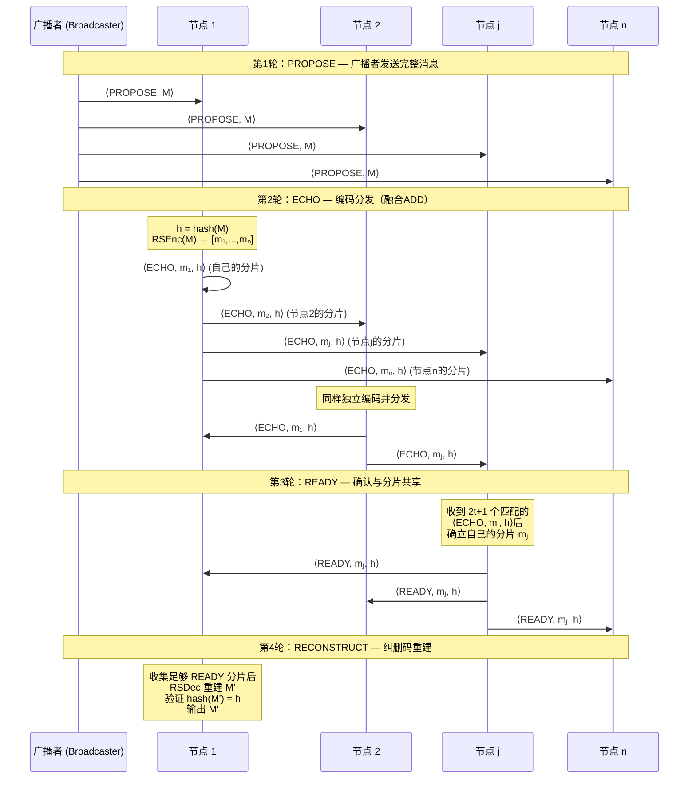
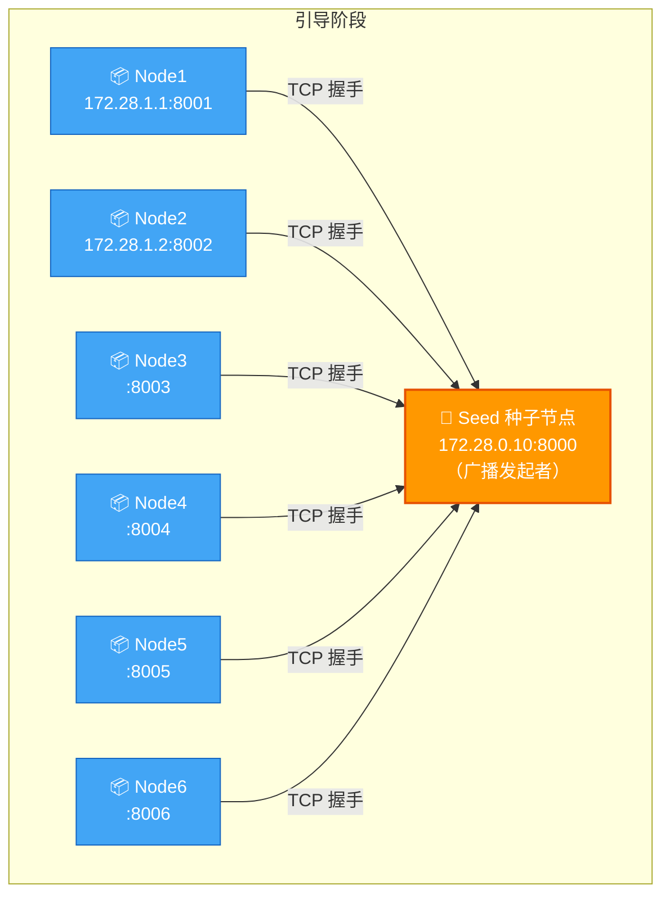
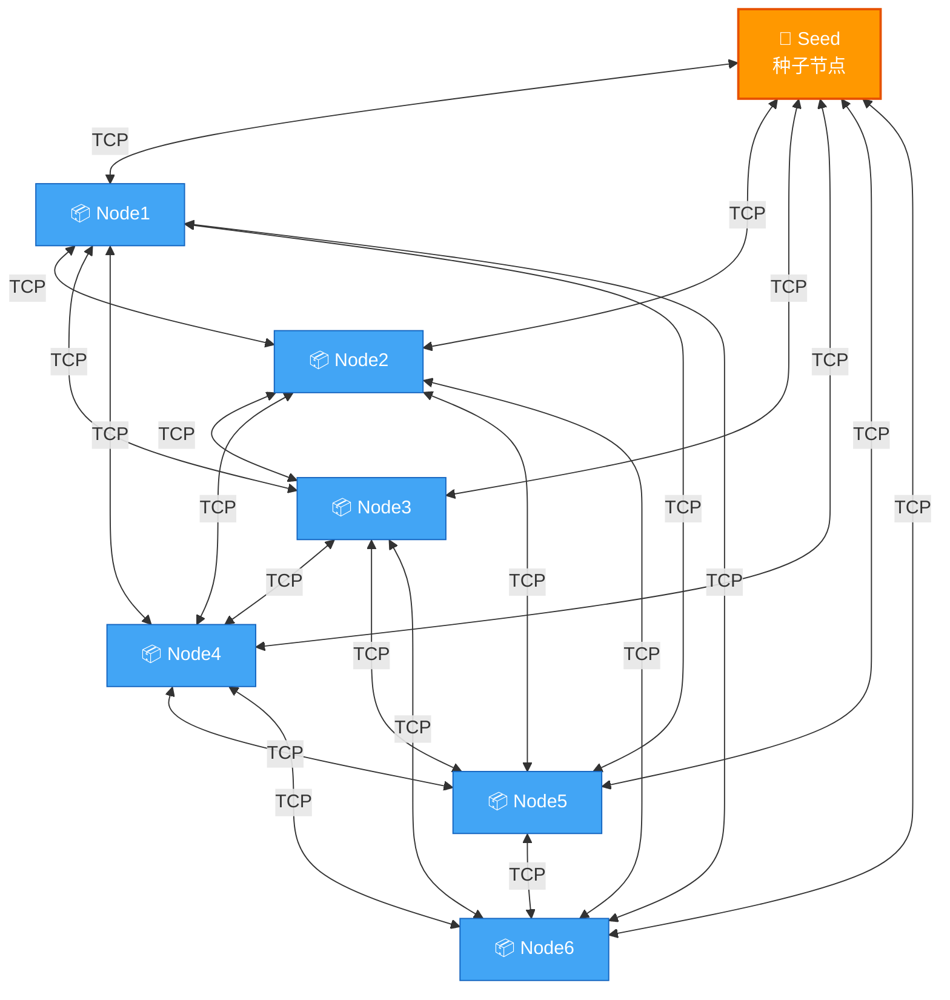
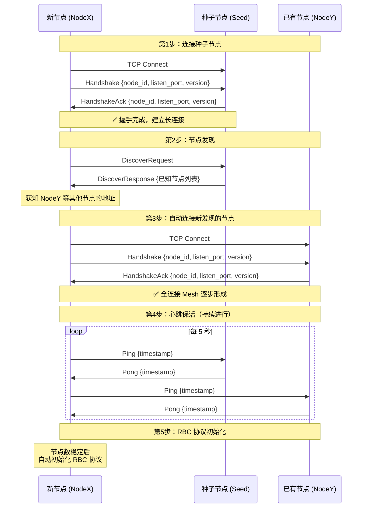
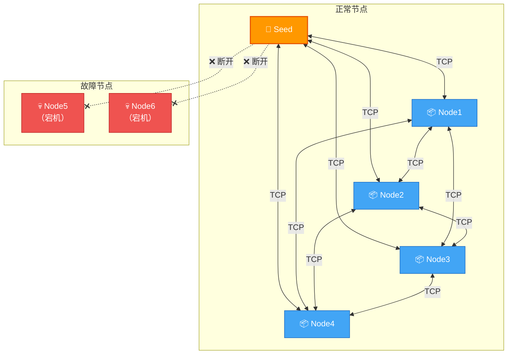
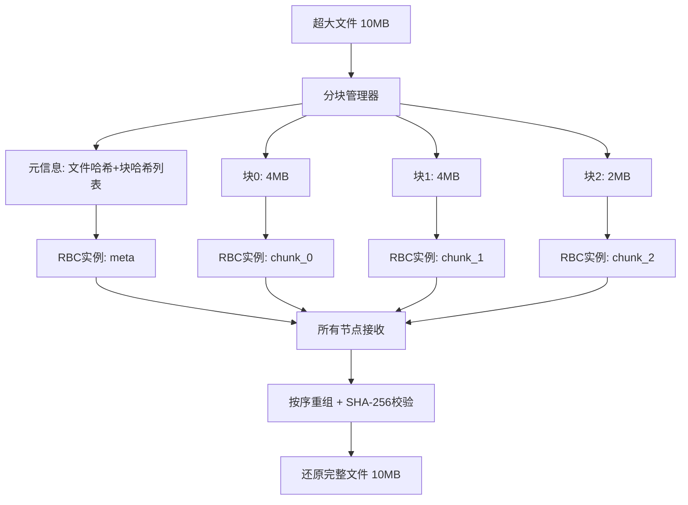

# 高容错分布式数据分发系统

基于 **Bracha RBC（可靠广播协议）** ，**去中心化P2P网络**和 **Reed-Solomon 纠删码** 的拜占庭容错分布式数据分发系统。

> **分支说明**：本项目共有三个主要分支，承载了系统从原型到优化的完整演进过程：
>
> | 分支 | 角色 | 内容 |
> |---|---|---|
> | `master` | 原型系统 | 完整系统实现 + RS 纠错性能瓶颈分析（优化前基线） |
> | `fix` | RS 纠错算法修复 | 修复 `reed_solomon_rs` 库 Berlekamp-Welch **逐字节冗余调用**问题，纠错解码性能提升 **500~800 倍** |
> | `dev1` ⭐ | SIMD 向量化优化（**当前分支**，主要开发分支） | 在 `fix` 基础上使用 **SSSE3/AVX2 `pshufb`** 加速 GF(2⁸) 向量运算，`addmul()` 核心热循环再提升 **40%~65%** |
>
> 本 README 合并了三个分支的文档，后续所有开发与文档维护均在 `dev1` 分支进行。RS 纠错优化的完整历程详见 [RS 纠错解码性能瓶颈分析与优化历程](#rs-纠错解码性能瓶颈分析与优化历程) 章节。

## 系统架构

```
┌─────────────────────────────────────────────────┐
│                   应用层 (main.rs)               │
│         程序入口、环境变量配置、RBC输出监控        │
├─────────────────────────────────────────────────┤
│              RBC协议层 (src/rbc/)                │
│  protocol.rs  - Bracha RBC协议核心状态机（含计时日志）│
│  manager.rs   - 多实例并发管理器                 │
│  chunked.rs   - 超大文件分块广播管理器          │
│  types.rs     - 消息类型、配置、状态定义          │
│  test_rbc.rs  - 单元测试（含拜占庭容错+切片策略对比）│
├─────────────────────────────────────────────────┤
│            纠删码层 (src/erasure/)               │
│  codec.rs     - Reed-Solomon编解码器             │
│  shard.rs     - 分片数据结构与序列化              │
│  test_erasure.rs - 纠删码单元测试                │
├─────────────────────────────────────────────────┤
│             网络层 (src/network/)                │
│  node.rs       - P2P节点核心逻辑                 │
│  connection.rs - TCP连接管理                     │
│  discovery.rs  - 节点发现机制                    │
│  peer.rs       - 对等节点管理                    │
│  message.rs    - 网络消息序列化/反序列化          │
│  config.rs     - 节点配置                        │
├─────────────────────────────────────────────────┤
│          底层 RS 库 (deps/reed_solomon_rs/)      │
│  decoder/berlekamp_welch.rs - BW 纠错（fix 分支重写） │
│  math/addmul.rs             - GF(2⁸) 乘加（dev1 分支 SIMD 优化） │
└─────────────────────────────────────────────────┘
```

## 项目结构

```
bishe/
├── Cargo.toml                  # Rust项目配置和依赖（reed_solomon_rs 已改为 path 依赖）
├── Cargo.lock                  # 依赖锁定文件
├── Dockerfile                  # Docker镜像构建文件
├── docker-compose.yml          # 默认7节点集群编排配置（向后兼容）
├── docker-compose.dynamic.yml  # 测试脚本动态生成的配置（自动创建）
├── test_p2p.sh                 # P2P网络集成测试脚本（支持 -n 参数）
├── test_rbc_docker.sh          # RBC端到端测试脚本（支持 -n 参数）
├── README.md                   # 本文件（合并自 master/fix/dev1 三个分支）
├── csv/                        # 存放 rbc docker 测试与性能测试的 CSV 结果
├── deps/
│   └── reed_solomon_rs/        # 本地化的 RS 库源码（fix/dev1 分支的优化目标）
│       └── src/
│           ├── decoder/berlekamp_welch.rs   # fix 分支：重写 correct() 消除逐字节冗余
│           └── math/addmul.rs                # dev1 分支：AVX2/SSSE3 SIMD 加速
└── src/
    ├── main.rs                 # 程序入口
    ├── lib.rs                  # 库模块声明
    ├── erasure/                # 纠删码模块
    │   ├── mod.rs
    │   ├── codec.rs            # Reed-Solomon编解码器
    │   ├── shard.rs            # 分片数据结构
    │   └── test_erasure.rs     # 纠删码单元测试（25个用例，含7个Berlekamp-Welch纠错测试）
    ├── rbc/                    # RBC协议模块
    │   ├── mod.rs
    │   ├── protocol.rs         # Bracha RBC协议核心状态机（含RS编解码/哈希计时日志）
    │   ├── manager.rs          # 多实例并发管理器（RbcManager）
    │   ├── chunked.rs          # 超大文件分块广播管理器（6个单元测试）
    │   ├── types.rs            # 类型定义（含自定义分片参数 with_custom_shards）
    │   └── test_rbc.rs         # RBC单元测试（22个用例，含8个拜占庭+6个切片策略对比实验）
    └── network/                # P2P网络模块
        ├── mod.rs
        ├── node.rs             # P2P节点核心
        ├── connection.rs       # TCP连接管理
        ├── discovery.rs        # 节点发现
        ├── peer.rs             # 对等节点管理
        ├── message.rs          # 消息序列化
        └── config.rs           # 节点配置
```

---

## 核心算法：基于 ADD 优化的四轮长消息 RBC 协议

### 算法背景

本系统的核心是一个**融合了 ADD（Avid Data Dissemination）编码分发思想的 Bracha RBC 协议**。

经典的 Bracha RBC 协议在广播长消息时存在 **O(n²|M|)** 的通信复杂度问题——每个节点都需要转发完整消息，导致网络开销随节点数平方增长。ADD 协议通过纠删码将消息编码为 n 个分片，每个节点只需转发自己的分片，将通信复杂度降低到 **O(n|M|)**。

本系统将两者融合：**将 ADD 的"编码与分发"过程嵌入到 Bracha RBC 的 ECHO 和 READY 投票消息中**，在保持拜占庭容错能力的同时，大幅降低通信开销。

### 协议参数

对于 n 个节点的网络，最大容错拜占庭节点数 `t = ⌊(n-1)/3⌋`（满足 `n ≥ 3t + 1`）：

| 参数 | 计算公式 | 含义 |
|------|---------|------|
| **数据分片数 k** | k = t + 1 | RS 编码的信息符号数 |
| **总分片数 n** | 等于节点数 | 每个节点对应一个分片 |
| **校验分片数** | n - k | RS 编码的冗余符号数 |
| **ECHO 阈值** | 2t + 1 | 确认分片所需的一致 ECHO 数 |
| **READY 放大阈值** | t + 1 | 触发 READY 放大所需的 READY 数 |
| **重建阈值** | 2t + r + 1 (r=0..t) | 纠错重建所需的最小分片数 |

### 四轮协议流程



### 算法伪代码

```
算法：四轮长消息 RBC 协议（融合 ADD 优化）
输入：广播者持有消息 M，网络共 n 个节点，容错上限 t = ⌊(n-1)/3⌋

═══════════════════════════════════════════════════════════════
第1轮 PROPOSE（广播者执行）:
═══════════════════════════════════════════════════════════════
  1: 广播者向所有节点发送 ⟨PROPOSE, M⟩

═══════════════════════════════════════════════════════════════
第2轮 ECHO（所有节点执行）:
═══════════════════════════════════════════════════════════════
  2: upon receiving ⟨PROPOSE, M⟩ from broadcaster:
  3:   if P(M) = true then                    // 验证消息合法性
  4:     h := hash(M)                          // 计算消息哈希
  5:     [m₁, m₂, ..., mₙ] := RSEnc(M, n, t+1)  // RS编码为n个分片
  6:     for j = 1 to n do
  7:       send ⟨ECHO, mⱼ, h⟩ to node j       // 向节点j发送其专属分片

═══════════════════════════════════════════════════════════════
第3轮 READY（所有节点执行）:
═══════════════════════════════════════════════════════════════
  8: upon receiving 2t+1 matching ⟨ECHO, mᵢ, h⟩:
  9:   if not yet sent READY then
 10:     确立自己的分片 mᵢ                     // 2t+1个一致ECHO确认
 11:     send ⟨READY, mᵢ, h⟩ to all           // 向全网广播自己的分片

 12: upon receiving t+1 ⟨READY, *, h⟩ and not yet sent READY:
 13:   wait for t+1 matching ⟨ECHO, mᵢ', h⟩   // READY放大机制
 14:   send ⟨READY, mᵢ', h⟩ to all

═══════════════════════════════════════════════════════════════
第4轮 RECONSTRUCT（所有节点执行）:
═══════════════════════════════════════════════════════════════
 15: 维护分片集合 T_h = {(j, mⱼ*)}            // 从READY消息中收集
 16: for r = 0 to t do                         // 逐步增加纠错容量
 17:   upon |T_h| ≥ 2t + r + 1 do
 18:     M' := RSDec(t+1, r, T_h)              // RS解码（纠r个错）
 19:     if hash(M') = h then                  // 哈希验证
 20:       output M' and return                // 输出并终止
```

### 与经典协议的对比

| 特性 | 经典 Bracha RBC | ADD 协议 | 本系统（融合方案） |
|------|----------------|----------|------------------|
| **通信复杂度** | O(n²\|M\|) | O(n\|M\|) | **O(n\|M\|)** |
| **拜占庭容错** | ✅ t < n/3 | ❌ 仅崩溃容错 | **✅ t < n/3** |
| **消息轮次** | 3轮 | 3轮 | **4轮** |
| **ECHO 内容** | 完整消息 M | 分片 mⱼ | **分片 mⱼ + 哈希 h** |
| **READY 内容** | 哈希 h | 分片 mⱼ | **分片 mⱼ + 哈希 h** |
| **数据重建** | 无需（已有完整消息） | RS 解码 | **RS 解码 + 哈希验证** |
| **纠错能力** | — | 仅纠删 | **逐步纠错 (r=0..t)** |

### 关键设计亮点

#### 1. ECHO 阶段融合编码分发

经典 Bracha RBC 的 ECHO 消息携带完整消息 M，导致每个节点需要发送 n 份完整消息。本方案将 ADD 的编码分发融入 ECHO 阶段：每个节点独立对 M 进行 RS 编码，然后**只向节点 j 发送其专属分片 mⱼ**，而非完整消息。这将 ECHO 阶段的通信量从 O(n²|M|) 降低到 O(n|M|)。

#### 2. READY 阶段携带分片实现 Reconstruction 共享

经典 Bracha RBC 的 READY 消息只携带哈希值。本方案让 READY 消息**同时携带发送者自己的分片**，使得 READY 阶段不仅完成投票确认，还同时完成了分片的全网共享，为后续的纠删码重建提供数据来源。

#### 3. 渐进式纠错重建

在 RECONSTRUCT 阶段，算法不是简单地等待足够分片后一次性解码，而是采用**渐进式纠错策略**：从 r=0（无纠错，需要 2t+1 个分片）开始，逐步增加纠错容量到 r=t（最大纠错，需要 3t+1 个分片）。每次尝试解码后都通过哈希验证结果正确性，确保即使存在拜占庭节点发送错误分片，也能通过增加冗余来纠正。

```
r=0: 需要 2t+1 个分片，纠 0 个错（所有分片都正确时最快完成）
r=1: 需要 2t+2 个分片，纠 1 个错
...
r=t: 需要 3t+1 个分片，纠 t 个错（极限容错）
```

#### 4. Berlekamp-Welch 纠错 + 整体哈希验证

本协议**不在分片级别做哈希校验**，而是依赖底层 RS 码的 Berlekamp-Welch 纠错能力自动检测和纠正恶意分片。这是算法4的核心设计：

- **纠错解码**：`RSDec(t+1, r, T_h)` 使用 Berlekamp-Welch 算法，可在不知道哪些分片被篡改的情况下，自动纠正最多 `⌊(|T_h| - k) / 2⌋` 个错误分片
- **整体哈希验证**：解码后通过 `hash(M') = h` 验证最终结果的正确性，确保输出与广播者原始消息一致
- **无分片级校验**：ECHO 和 READY 消息中不携带分片哈希（`shard_hash`），恶意分片直接进入 T_h 集合，由纠错解码统一处理

### 安全性保证

在 n ≥ 3t + 1 的前提下，本协议满足 RBC 的三个核心安全属性：

| 属性 | 说明 | 保证机制 |
|------|------|---------|
| **一致性 (Agreement)** | 如果两个诚实节点分别输出 M 和 M'，则 M = M' | ECHO 阈值 2t+1 确保至少 t+1 个诚实节点确认同一哈希 |
| **完整性 (Validity)** | 如果广播者是诚实的且广播 M，则所有诚实节点最终输出 M | 诚实广播者的 PROPOSE 保证所有诚实节点收到正确消息 |
| **终止性 (Totality)** | 如果某个诚实节点输出了消息，则所有诚实节点最终都会输出 | READY 放大机制确保：一旦 t+1 个节点发送 READY，所有诚实节点都会跟进 |

---

## 环境要求

### 本地单元测试

- **Rust** >= 1.85（推荐使用 `rustup` 安装）
- **Cargo**（随 Rust 一起安装）
- **CPU 指令集**（dev1 分支推荐）：支持 AVX2 或 SSSE3 的 x86/x86_64 处理器可自动启用 SIMD 加速，否则回退到标量实现

### Docker 集成测试

- **Docker** >= 20.10
- **Docker Compose** >= 2.0
- **Bash**（Linux/macOS 自带，Windows 可使用 Git Bash 或 WSL）

## 快速开始

### 1. 克隆项目

```bash
git clone https://github.com/sway-wzc/bishe.git
cd bishe
git checkout dev1      # 切换到主要开发分支
```

### 2. 编译项目

```bash
cargo build --release
```

---

## 测试指南

本系统提供 **三个层次** 的测试：

| 层次 | 测试内容 | 运行方式 | 耗时 |
|------|---------|---------|------|
| **单元测试** | 纠删码编解码 + RBC协议逻辑 + 拜占庭容错 + 分块广播 + 切片策略对比实验（50+ 个用例） | `cargo test` | ~5秒 |
| **P2P网络集成测试** | Docker多节点组网、握手、心跳、容错 | `bash test_p2p.sh [-n N]` | ~3分钟 |
| **RBC端到端测试** | Docker多节点文件广播分发与数据完整性验证 | `bash test_rbc_docker.sh [-n N]` | ~20分钟 |

---

### 一、单元测试（本地运行，无需Docker）

#### 运行全部单元测试

```bash
cargo test --lib -- --nocapture
```

#### 按模块运行测试

```bash
# 纠删码模块测试（25个用例）
cargo test --lib erasure::test_erasure -- --nocapture

# RBC协议模块测试（22个用例，含6个切片策略对比实验）
cargo test --lib rbc::test_rbc -- --nocapture

# SIMD 单元测试（dev1 分支新增，5 个用例）
cd deps/reed_solomon_rs && cargo test --release test_addmul -- --nocapture
```

#### 按类别运行测试

```bash
# 仅运行RBC基础功能测试
cargo test --lib rbc::test_rbc::test_rbc -- --nocapture

# 仅运行拜占庭恶意节点测试（8个用例）
cargo test --lib rbc::test_rbc::test_byzantine -- --nocapture

# 仅运行切片策略对比实验（6个用例）
cargo test --lib rbc::test_rbc::test_strategy -- --nocapture

# 仅运行分块广播测试（6个用例）
cargo test --lib rbc::chunked -- --nocapture

# 仅运行 RS 纠错解码性能测试（fix/dev1 分支重点）
cargo test --release perf -- --nocapture
```

#### 运行单个测试

```bash
# 示例：运行7节点基础测试
cargo test --lib rbc::test_rbc::test_rbc_7_nodes -- --nocapture

# 示例：运行混合攻击测试
cargo test --lib rbc::test_rbc::test_byzantine_mixed_attack_7_nodes -- --nocapture
```

#### 单元测试用例清单

**纠删码模块** (`src/erasure/test_erasure.rs`)：

| 测试名 | 说明 |
|--------|------|
| `test_basic_encode_decode` | 基本编解码正确性 |
| `test_recover_with_lost_data_shards` | 丢失数据分片后恢复 |
| `test_recover_with_lost_parity_shards` | 丢失校验分片后恢复 |
| `test_recover_with_mixed_loss` | 混合丢失分片恢复 |
| `test_too_many_lost_shards` | 超过容错上限的错误处理 |
| `test_small_data` | 小数据编解码 |
| `test_large_data` | 大数据编解码 |
| `test_shard_integrity_verification` | 分片完整性校验（SHA-256） |
| `test_verify_roundtrip` | 编解码往返一致性 |
| `test_storage_overhead` | 存储开销计算 |
| `test_fault_tolerance_info` | 容错信息输出 |
| `test_shard_serialization` | 分片序列化/反序列化 |
| `test_empty_data_error` | 空数据错误处理 |
| `test_invalid_codec_params` | 无效参数错误处理 |
| `test_different_codec_configurations` | 不同编码配置测试 |
| `test_error_correction_single_corruption` | 🔧 Berlekamp-Welch 单分片纠错 |
| `test_error_correction_two_corruptions` | 🔧 Berlekamp-Welch 双分片纠错 |
| `test_error_correction_mixed_loss_and_corruption` | 🔧 丢失+篡改混合纠错 |
| `test_error_correction_with_larger_parity` | 🔧 高冗余配置纠错 |
| `test_error_correction_exceeds_capacity` | 🔧 超过纠错能力的损坏测试 |
| `test_error_correction_capacity_values` | 🔧 纠错容量边界值测试 |
| `test_error_correction_large_data` | 🔧 大数据纠错测试 |
| `test_rs_correction_perf_n13_k5` | 📈 RS 纠错解码性能测试（n=13, k=5, BFT 极限） |
| `test_rs_correction_perf_n10_k4` | 📈 RS 纠错解码性能测试（n=10, k=4, BFT 极限） |
| `test_rs_correction_perf_scaling` | 📈 RS 纠错解码耗时随数据大小增长趋势 |
| `test_master_vs_dev1_progressive_r_loop_n7` | 🔬 模拟 RBC 算法 4 渐进 r 循环：对比 master 逐字节 BW vs dev1 整片丢弃在 n=7 下的首次真成功 r 值与单轮耗时（含稀疏/密集两种错误分布） |
| `test_master_vs_dev1_progressive_r_loop_n13_large` | 🔬 同上，n=13 BFT 极限配置，20KB 分片密集错误 |

**SIMD 单元测试**（`deps/reed_solomon_rs/src/math/addmul.rs`，dev1 分支新增）：

| 测试名 | 说明 |
|--------|------|
| `test_addmul_correctness_small` | 遍历所有 256 个乘数，验证 SIMD 与标量结果一致 |
| `test_addmul_correctness_large` | 覆盖多种数据长度（1~4096），验证 AVX2 主循环 + SSE 尾部 + 标量尾部 |
| `test_addmul_gfval_correctness` | 验证 GfVal 版本与标量版本一致 |
| `test_addmul_zero_multiplier` | 验证乘数为 0 时的快速返回 |
| `test_simd_feature_detection` | 打印 CPU SIMD 支持情况，验证检测逻辑 |

**RBC协议模块** (`src/rbc/test_rbc.rs`)：

| 测试名 | 说明 |
|--------|------|
| `test_rbc_config` | RBC配置参数验证 |
| `test_rbc_basic_4_nodes` | 4节点基础广播 |
| `test_rbc_7_nodes` | 7节点广播（n=7, t=2） |
| `test_rbc_with_node_failure` | 节点掉线容错测试 |
| `test_rbc_large_data` | 大数据广播测试 |
| `test_rbc_concurrent_broadcasts` | 并发多实例广播 |
| `test_rbc_10_nodes` | 10节点广播（n=10, t=3） |
| `test_rbc_data_integrity` | 数据完整性校验 |
| `test_byzantine_tampered_shard_data` | 🔴 恶意场景：篡改分片数据 |
| `test_byzantine_fake_hash` | 🔴 恶意场景：伪造数据哈希 |
| `test_byzantine_selective_silence` | 🔴 恶意场景：选择性沉默 |
| `test_byzantine_contradictory_echo` | 🔴 恶意场景：矛盾ECHO攻击 |
| `test_byzantine_mixed_attack_7_nodes` | 🔴 恶意场景：混合攻击 |
| `test_byzantine_max_tolerance_10_nodes` | 🔴 恶意场景：10节点极限容错 |
| `test_byzantine_forged_shard_index` | 🔴 恶意场景：伪造分片索引（7节点） |
| `test_byzantine_forged_shard_index_10_nodes` | 🔴 恶意场景：10节点极限伪造索引攻击 |
| `test_strategy_compare_k_values_7_nodes` | 📊 实验1：RS编码参数对比（n=7, 不同k值对传输/计算开销的影响） |
| `test_strategy_compare_k_values_10_nodes` | 📊 实验1b：RS编码参数对比（n=10, 不同k值） |
| `test_strategy_compare_file_sizes` | 📊 实验2：文件大小扩展性（不同文件大小对开销的影响） |
| `test_strategy_compare_chunk_sizes` | 📊 实验3：分块大小对比（不同分块大小对大文件传输开销的影响） |
| `test_strategy_compare_node_scales` | 📊 实验4：节点规模扩展性（不同节点数对开销的影响） |
| `test_strategy_no_coding_baseline` | 📊 实验5：无编码基线对比（证明纠删码的传输优化价值） |

**分块广播模块** (`src/rbc/chunked.rs`)：

| 测试名 | 说明 |
|--------|------|
| `test_chunked_broadcast_small_file` | 小文件分块广播（100字节） |
| `test_chunked_broadcast_multi_chunk` | 多分块文件广播（5KB→ 5块） |
| `test_chunked_broadcast_large_data` | 大数据分块广播（50KB，7节点） |
| `test_chunked_broadcast_with_node_failure` | 分块广播节点故障容错 |
| `test_chunked_broadcast_non_aligned_size` | 非对齐文件大小分块 |
| `test_chunked_broadcast_exact_one_byte` | 极小文件（1字节）分块广播 |

---

### 二、P2P网络集成测试（需要Docker）

测试 P2P 网络层的组网、握手、心跳和节点容错能力。支持通过 `-n` 参数指定节点总数。

```bash
# 默认7节点测试 (n=7, t=2)
bash test_p2p.sh

# 自定义节点数量
bash test_p2p.sh -n 4    # 4节点测试 (t=1)
bash test_p2p.sh -n 10   # 10节点测试 (t=3)
bash test_p2p.sh -n 13   # 13节点测试 (t=4)

# 查看帮助
bash test_p2p.sh -h
```

脚本会根据 `n` 自动计算容错数 `t = ⌊(n-1)/3⌋`，并动态生成 `docker-compose.dynamic.yml` 配置文件。

**测试内容：**

| 步骤 | 说明 |
|------|------|
| 测试1 | 构建Docker镜像 |
| 测试2 | 启动种子节点 |
| 测试3 | 启动所有普通节点（共n个） |
| 测试4 | 验证节点间握手连接 |
| 测试5 | 验证心跳机制 |
| 测试6 | 容错测试 - 单节点宕机 |
| 测试7 | 容错测试 - t个节点宕机（极限测试） |
| 测试8 | 容错测试 - 故障节点恢复重连 |
| 测试9 | 节点发现机制验证 |

---

### 三、RBC端到端测试（需要Docker）

测试完整的 RBC 协议流程：文件分片 → 纠删码编码 → 网络广播 → 各节点接收 → 纠删码解码恢复 → 数据完整性验证。支持通过 `-n` 参数指定节点总数。

```bash
# 默认7节点测试 (n=7, t=2)
bash test_rbc_docker.sh

# 自定义节点数量
bash test_rbc_docker.sh -n 4    # 4节点测试 (t=1)
bash test_rbc_docker.sh -n 10   # 10节点测试 (t=3)
bash test_rbc_docker.sh -n 13   # 13节点测试 (t=4)

# 查看帮助
bash test_rbc_docker.sh -h
```

脚本会根据 `n` 自动计算容错数 `t = ⌊(n-1)/3⌋`，动态生成 Docker 配置，并自动选择最后 t 个节点作为容错测试的故障节点。

**测试内容：**

| 步骤 | 说明 |
|------|------|
| 测试1 | 小文件广播（1KB） |
| 测试2 | 中等文件广播（100KB） |
| 测试3 | 大文件广播（1MB） |
| 测试4 | 文本文件广播 |
| 测试5 | 单节点故障容错广播（1MB） |
| 测试6 | t个节点故障容错广播（100KB，极限测试） |
| 测试7 | 超大文件分块广播（20MB，超过16MB限制，自动分块） |
| 测试8 | 超大文件分块广播（50MB，自动分块） |
| 测试9 | 🔴 恶意节点-篡改分片数据（100KB，按 `hash(node_id) % shard_len` 定位后**单字节翻转**，最贴近真实隐蔽攻击） |
| 测试10 | 🔴 恶意节点-伪造哈希（100KB，1个节点发送伪造的数据哈希） |
| 测试11 | 🔴 恶意节点-选择性沉默（100KB，1个节点拒绝发送ECHO/READY消息） |
| 测试12 | 🔴 t个混合恶意节点（100KB，BFT极限测试，t个节点以不同方式同时作恶；不同节点哈希到不同字节列） |
| 测试13 | 🔴 t个混合恶意节点（50MB，BFT极限 + 大文件压力，用于评估 RS 解码优化收益） |

- 测试1-8 验证所有存活节点接收到的数据的 **SHA-256 哈希** 是否与原始文件一致
- 测试9-13 为**拜占庭容错测试**，验证在恶意节点存在的情况下，所有诚实节点仍能正确完成 RBC 协议并输出正确数据，同时通过日志确认恶意行为已实际执行
- `CorruptShard` 模式采用**单字节精确翻转 + 节点哈希定位**：不同恶意节点的错误字节分布在不同的列上，对"只定位一次"型纠错算法构成压力测试（详见 [`src/network/node.rs` 的 `apply_byzantine_tampering()`](src/network/node.rs)）
- 每个测试用例自动采集**传输开销**（各节点网络收发字节数、传输放大比）和**计算开销**（RS编码/解码耗时、SHA-256哈希耗时），统计数据保存至 `rbc_stats_tmp/overhead_summary.csv`

---

## Docker 部署说明

### 网络拓扑
系统采用种子节点引导的去中心化架构，种子节点仅在启动阶段提供节点发现服务，稳态运行后所有节点完全对等，且支持多种子节点配置以消除单点故障。

测试脚本会根据 `-n` 参数动态生成 `docker-compose.dynamic.yml`，自动分配节点 IP 和端口：

| 节点 | 容器名 | IP地址 | 宿主机端口 | 角色 |
|------|--------|--------|-----------|------|
| seed | p2p-seed | 172.28.0.10 | 8000 | 种子节点（广播发起者） |
| node1 | p2p-node1 | 172.28.1.1 | 8001 | 普通节点 |
| node2 | p2p-node2 | 172.28.1.2 | 8002 | 普通节点 |
| ... | ... | ... | ... | ... |
| nodeN | p2p-nodeN | 172.28.1.N | 800N | 普通节点 |

> 默认的 `docker-compose.yml` 仍保留7节点静态配置，可直接用 `docker compose up -d` 手动启动。

### 网络初始化过程

#### 阶段一：种子节点引导（启动阶段）

所有普通节点启动时，首先通过 TCP 连接到种子节点（Seed），完成握手（Handshake / HandshakeAck）：



#### 阶段二：节点发现 → 全连接 Mesh 网络（稳态）

通过 `DiscoverRequest/Response` 消息交换已知节点列表，各节点自动发现并连接所有其他节点，最终形成**全连接 Mesh 拓扑**（每对节点之间都有一条 TCP 长连接）：



> **说明**：以 n=7 为例，全连接 Mesh 网络共有 C(7,2) = **21 条 TCP 长连接**。每条连接上承载握手、心跳（Ping/Pong）、节点发现（DiscoverRequest/Response）以及 RBC 协议消息（Propose/Echo/Ready）。

#### 节点组网与通信机制



#### 容错场景下的网络拓扑（n=7, t=2）



> **容错说明**：当 n=7 时，最大容错 t=2，即最多允许 2 个节点同时宕机或作恶。剩余 5 个诚实节点（≥ 2t+1=5）仍可正常完成 RBC 协议的广播与数据重建。心跳超时机制会自动检测并标记故障节点，故障节点恢复后可重新握手接入网络。

### 手动启动集群

```bash
# 方式1: 使用默认7节点静态配置
docker compose build
docker compose up -d

# 方式2: 使用测试脚本动态生成的配置
bash test_p2p.sh -n 10  # 会自动生成 docker-compose.dynamic.yml

# 查看节点状态
docker compose ps

# 查看某个节点日志
docker compose logs -f seed

# 停止并清理
docker compose down -v --remove-orphans
```

### 环境变量

| 变量名 | 说明 | 默认值 |
|--------|------|--------|
| `NODE_ID` | 节点唯一标识 | - |
| `LISTEN_PORT` | 监听端口 | 8000 |
| `SEED_ADDR` | 种子节点地址 | - |
| `IS_SEED` | 是否为种子节点 | false |
| `RUST_LOG` | 日志级别 | info |
| `RBC_TEST_FILE` | RBC测试文件路径 | - |
| `RBC_BROADCAST_DELAY` | 广播前等待时间（秒） | 35 |
| `RBC_OUTPUT_DIR` | RBC输出目录 | /app/rbc_output |
| `BYZANTINE_MODE` | 拜占庭模式（测试用：corrupt_shard/wrong_hash/silent） | - |
| `EXPECTED_NODES` | 期望的节点总数 | - |

---

## 核心参数说明

对于 n 个节点的系统，最大容错数 `t = ⌊(n-1)/3⌋`：

| 总节点数 n | 最大容错 t | 数据分片数 | 校验分片数 | ECHO阈值 | READY阈值 |
|-----------|-----------|-----------|-----------|----------|----------|
| 4 | 1 | 2 | 2 | 3 | 2 |
| 7 | 2 | 3 | 4 | 5 | 3 |
| 10 | 3 | 4 | 6 | 7 | 4 |

- **数据分片数** = t + 1
- **校验分片数** = n - (t + 1)
- **ECHO阈值** = 2t + 1（需要收到这么多一致的ECHO才进入READY阶段）
- **READY阈值** = t + 1（需要收到这么多一致的READY才输出数据）

---

## 超大文件分块广播

### 设计原理

系统支持**不限大小**的文件传输。当文件大小超过 4MB 时，自动启用分块广播模式：

```
超大文件 → 分块(4MB/块) → 每块独立RBC广播 → 接收端按序重组 → 还原完整文件
```



### 工作流程

1. **广播者**将文件按 4MB 分块，计算每块和整个文件的 SHA-256 哈希
2. 先通过 RBC 广播**元信息**（包含文件大小、分块数、各块哈希）
3. 再逐块通过独立的 RBC 实例广播每个数据块
4. **接收端**收到元信息后，自动收集各块数据
5. 所有块到齐后按序重组，验证每块哈希和整体文件哈希
6. 哈希全部匹配后输出完整文件

### 关键特性

| 特性 | 说明 |
|------|------|
| **自动分块** | 文件 ≤ 4MB 直接 RBC 广播，> 4MB 自动分块 |
| **不限大小** | 理论上支持任意大小的文件传输 |
| **完整性保证** | 每块 SHA-256 校验 + 整体文件 SHA-256 校验 |
| **拜占庭容错** | 每个分块独立走 RBC 协议，继承完整的 BFT 保证 |
| **并发广播** | 多个分块可并发进行 RBC 广播 |
| **透明切换** | 调用者无需关心文件大小，系统自动选择广播模式 |

---

## 切片策略对比实验

系统内置了 **6 组切片策略对比实验**，用于量化分析不同 RS 编码参数对传输开销与计算开销的影响。

### 运行实验

```bash
# 运行全部6个切片策略对比实验
cargo test --lib rbc::test_rbc::test_strategy -- --nocapture

# 运行单个实验
cargo test --lib rbc::test_rbc::test_strategy_compare_k_values_7_nodes -- --nocapture
cargo test --lib rbc::test_rbc::test_strategy_no_coding_baseline -- --nocapture
```

### 实验设计

| 实验 | 变量 | 固定参数 | 目的 |
|------|------|---------|------|
| **实验1** | k=2,3,4,5,6 | n=7, 100KB | 不同 k 值对传输放大比和编解码耗时的影响 |
| **实验1b** | k=2,4,5,7,9 | n=10, 100KB | 10 节点场景下的 k 值对比 |
| **实验2** | 1KB~1MB | n=7, k=3 | 文件大小对传输放大比和编解码耗时的扩展性 |
| **实验3** | 5KB~50KB 分块 | n=7, 50KB | 不同分块大小对大文件传输开销的影响 |
| **实验4** | n=4,7,10,13 | k=t+1, 100KB | 节点规模对传输放大比的扩展性 |
| **实验5** | k=1~6 | n=7, 100KB | 无编码基线 vs 纠删码策略的传输优化价值 |

### 统计指标

每个实验自动统计以下指标：

| 指标 | 说明 |
|------|------|
| **传输消息数** | RBC 协议中 PROPOSE/ECHO/READY 消息的总数 |
| **传输字节数** | 所有消息的总传输量（含分片数据和元信息） |
| **传输放大比** | 总传输字节数 / 原始文件大小 |
| **RS 编码耗时** | Reed-Solomon 编码的计算时间 |
| **RS 解码耗时** | Reed-Solomon 解码的计算时间 |
| **端到端总耗时** | 从广播发起到所有节点完成的总时间 |

### 实验结论示例（n=7, 100KB）

| 策略 | k | p | 传输放大比 | RS编码 | RS解码 |
|------|---|---|-----------|--------|--------|
| 无编码基线 | 1 | 6 | **105.13x** | 14.0ms | 12.6ms |
| 高冗余 | 2 | 5 | 56.13x | 8.7ms | 6.5ms |
| **标准(k=t+1)** | **3** | **4** | **39.80x** | **6.5ms** | **4.1ms** |
| 对称 | 4 | 3 | 31.63x | 5.2ms | 2.7ms |
| 低冗余 | 6 | 1 | 23.46x | 3.4ms | 0.9ms |

> **结论**：k 越大，传输放大比和计算开销均越低，但纠错能力越弱。标准策略 k=t+1 是安全性与效率的最佳平衡点——相比无编码基线节省 **62.1%** 传输量，同时计算开销也更低。

### Docker 端到端开销统计

RBC 端到端测试脚本（`test_rbc_docker.sh`）也内置了开销统计功能：

- **传输开销**：通过 Docker 容器网络接口统计（`/sys/class/net/eth0/statistics/`）采集各节点发送字节数（TX），传输放大比 = 总TX / 原始文件大小
- **计算开销**：从容器日志中提取 RS 编码/解码和 SHA-256 哈希的耗时数据
- **理论分析**：自动计算 PROPOSE/ECHO/READY 各阶段的理论传输量、理论传输放大比，以及修正传输放大比（`理论值 × (n-1)/n`，扣除本地消息不经过网卡的部分）
- **CSV 汇总**：所有测试的开销数据自动写入 `rbc_stats_tmp/overhead_summary.csv`，便于后续分析

#### 实测数据与理论值对比（n=7, t=2）

| 测试场景 | 文件大小 | 实测TX放大比 | 修正理论放大比 | 误差 |
|---|---|---|---|---|
| 大文件广播 | 1MB | 35.03x | 33.99x | +3.1% |
| 超大文件分块广播 | 20MB | 34.10x | 33.99x | +0.3% |
| 超大文件分块广播 | 50MB | 34.07x | 33.99x | +0.2% |
| 中等文件广播 | 100KB | 43.55x | 33.99x | +28%* |
| 小文件广播 | 1KB | 919.28x | 33.99x | 极大* |

> \* 小文件的偏差主要来自控制面流量（心跳、节点发现等固定开销），文件越小占比越大。大文件（≥1MB）的实测值与修正理论值高度吻合（误差 <3%）。
>
> **修正理论放大比** = 理论放大比 × (n-1)/n = 39.66 × 6/7 ≈ 33.99x。因为每个节点发给自己的 ECHO/READY 消息在本地直接处理，不经过网卡，所以实际网卡统计到的 TX 比理论值少 1/n。

---

## RS 纠错解码性能瓶颈分析与优化历程

本章节合并了 `master`（问题发现与基线）→ `fix`（算法级优化）→ `dev1`（SIMD 向量化优化）三个分支的完整演进脉络。

### 一、问题发现（master 分支基线）

通过 Docker 端到端测试的实测数据，我们发现：**大文件传输场景下，RS 纠错解码的计算开销是制约系统吞吐量的首要瓶颈**，尤其在存在恶意节点时，性能退化极为严重。

#### 为什么聚焦大文件？

系统吞吐量（MB/s）只有在大文件传输时才能充分体现。小文件的端到端延迟主要由网络 RTT 和协议握手开销主导，RS 编解码耗时占比极低；而大文件传输中，RS 编解码成为计算密集型瓶颈。

以 n=13（t=4）为例，50MB 文件的正常场景吞吐量为 **5.83 MB/s**，编解码总耗时 952ms 仅占端到端延迟 8581ms 的 11%——此时网络传输是主要瓶颈。但一旦引入恶意节点，情况发生剧变。

#### 恶意节点下 RS 解码耗时暴增的实测数据

以下数据来自 `csv/overhead_summary_n13.csv` 和 `csv/overhead_summary_n10.csv`：

**n=13（t=4）场景：50MB 文件**

| 场景 | RS解码耗时 | 编解码总耗时 | 端到端延迟 | 吞吐量 |
|------|-----------|------------|-----------|--------|
| 正常（测试8） | 469ms | 953ms | 8,581ms | **5.83 MB/s** |
| 4个恶意节点-BFT极限（测试13） | **48,629ms** | 49,022ms | 53,348ms | **0.94 MB/s** |
| **退化倍数** | **×103.7** | **×51.4** | **×6.2** | **↓83.9%** |

**n=10（t=3）场景：50MB 文件**

| 场景 | RS解码耗时 | 编解码总耗时 | 端到端延迟 | 吞吐量 |
|------|-----------|------------|-----------|--------|
| 正常（测试8） | 313ms | 687ms | 5,065ms | **9.87 MB/s** |
| 3个恶意节点-BFT极限（测试13） | **19,825ms** | 20,117ms | 26,655ms | **1.88 MB/s** |
| **退化倍数** | **×63.3** | **×29.3** | **×5.3** | **↓81.0%** |

**n=13 场景：100KB 文件（对比参照）**

| 场景 | RS解码耗时 | 编解码总耗时 | 端到端延迟 | 吞吐量 |
|------|-----------|------------|-----------|--------|
| 正常（测试2） | 0.78ms | 1.28ms | 1,745ms | 0.056 MB/s |
| 4个恶意节点-BFT极限（测试12） | **90.47ms** | 90.91ms | 1,682ms | 0.058 MB/s |
| **退化倍数** | **×116.0** | **×71.0** | ×0.96 | 几乎无影响 |

#### 关键规律

1. **RS 解码耗时与文件大小成正比放大**：50MB 文件在恶意场景下的 RS 解码耗时高达 48.6 秒（n=13），而 100KB 文件仅 90ms——解码耗时随文件大小线性增长，但恶意场景下的增长系数远大于正常场景
2. **恶意节点下 RS 解码耗时占端到端延迟的绝对主导地位**：在 n=13 的 BFT 极限场景中，RS 解码耗时（48,629ms）占端到端延迟（53,348ms）的 **91.2%**
3. **小文件不受影响**：100KB 文件即使在 BFT 极限场景下，端到端延迟几乎不变（1,745ms vs 1,682ms），因为 RS 解码耗时（90ms）相对于网络延迟可忽略不计
4. **吞吐量退化严重**：大文件场景下，恶意节点导致吞吐量下降超过 80%，从 5.83 MB/s 降至 0.94 MB/s（n=13）

> **结论**：RS 纠错解码是恶意节点场景下系统吞吐量的首要瓶颈。优化 RS 纠错解码性能是提升系统在 BFT 极限场景下大文件传输吞吐量的最有效手段。

### 二、根因分析：`reed_solomon_rs` 库的实现缺陷

通过对底层依赖库 `reed_solomon_rs 0.1.2` 的源码分析，定位到纠错解码耗时暴增的根本原因。

#### 核心缺陷：逐字节独立调用 Berlekamp-Welch 算法

库的 `correct()` 方法在检测到错误后，**对分片数据的每个字节位置独立调用一次完整的 `berlekamp_welch()` 函数**：

```rust
// reed_solomon_rs 的 correct() 原始实现（简化）
pub fn correct(&self, shares: &mut Vec<Share>) -> Result<(), ...> {
    let synd = self.syndrome_matrix(&shares)?;
    let mut buf = vec![0u8; shares[0].data.len()];

    for i in 0..synd.r {
        for j in 0..buf.len() {          // buf.len() = 分片大小（可达数十万~数百万字节）
            // ... syndrome 检查 ...
            if buf[j] != 0 {
                // 🔥 对每个出错的字节位置，独立运行一次完整的 BW 算法！
                let data = self.berlekamp_welch(&shares, j)?;
                for i in 0..shares.len() {
                    shares[i].data[j] = data[shares[i].number];
                }
            }
        }
    }
}
```

以 n=13, k=5 的配置为例，50MB 文件分成 13 个 chunk（每个约 4MB），RS 编码后每个分片大小约 `4MB / 5 ≈ 800KB`。当恶意节点完全篡改分片时：

- **每个出错的字节位置**都触发一次 `berlekamp_welch()` 调用
- 每次调用内部需要进行 **dim×dim 矩阵求逆**（dim ≈ n = 13，复杂度 O(dim³)）
- 总计算量：**800,000 × 13³ ≈ 17.6 亿次 GF(2⁸) 运算**

这就是 50MB 文件在恶意场景下 RS 解码耗时高达 48.6 秒的根本原因。

#### 其他性能问题

| 问题 | 位置 | 影响 |
|------|------|------|
| `GfVal::pow()` 使用 O(n) 线性循环而非 O(1) 查表 | `gf_alg.rs` | 矩阵填充阶段的常数因子 |
| `GfPoly::div()` 中大量 `Vec::remove(0)` 导致 O(n) 内存移动 | `gf_alg.rs` | 多项式除法的常数因子 |
| `GfMat::index_row()` 每次调用都 clone 整行（堆分配） | `gf_alg.rs` | 矩阵运算中的内存分配开销 |
| `addmul()` 逐字节查表，无 SIMD 向量化 | `addmul.rs` | 编码和 rebuild 的核心热循环 |

### 三、优化一（`fix` 分支）：消除 BW 逐字节冗余调用

#### 数学原理

Berlekamp-Welch 算法的关键数学性质：**错误定位多项式 E(x) 与具体字节位置无关**。

E(x) 的根只取决于**哪些分片是错误的**（即错误的位置），而不取决于错误的具体内容（即每个字节被篡改成了什么值）。因此：

1. 只需对**一个字节位置**运行 BW 算法，即可得到错误定位多项式 E(x)
2. 通过 E(x) 的根确定哪些分片是错误的
3. 丢弃错误分片，用剩余正确分片调用 `rebuild()` 恢复数据

#### 复杂度对比

| | 原始实现 | fix 分支优化后 |
|---|---|---|
| BW 调用次数 | shard_size 次（~800,000） | **1 次** |
| 矩阵求逆 | shard_size × O(dim³) | **1 × O(dim³)** |
| rebuild | 无（逐字节修复） | 1 × O(k² × shard_size) |
| **总复杂度** | O(shard_size × dim³) | **O(dim³ + k² × shard_size)** |

#### 优化后的 correct() 流程

```
correct(shares):
  1. syndrome 矩阵快速检测 → 无错误则直接返回（快速路径）
  2. 找到一个 syndrome 非零的字节位置 error_byte_index
  3. 对该字节位置运行一次 BW 算法 → 得到错误定位多项式 E(x)
  4. 遍历所有分片，E(eval_point(share.number)) == 0 的即为错误分片
  5. 丢弃错误分片（shares.retain）
  6. 剩余正确分片数 ≥ k → 后续 rebuild() 可正常恢复数据
```

#### 修改文件清单（fix 分支相对 master）

| 文件 | 改动说明 |
|------|---------|
| `Cargo.toml` | `reed_solomon_rs` 依赖从 crates.io 版本改为本地 path 依赖 |
| `deps/reed_solomon_rs/` | 从 cargo registry 复制的库源码（完整保留） |
| `deps/reed_solomon_rs/src/decoder/berlekamp_welch.rs` | **核心改动**：重写 `correct()`，新增 `find_error_byte_index()` 和 `berlekamp_welch_locate_errors()` |
| `src/erasure/test_erasure.rs` | 性能测试数据大小聚焦大文件（20MB~100MB） |

**新增方法：**

| 方法 | 说明 |
|------|------|
| `find_error_byte_index()` | 遍历 syndrome 矩阵，找到第一个非零的字节位置 |
| `berlekamp_welch_locate_errors()` | 对单个字节位置运行 BW 算法，通过 E(x) 的根定位所有错误分片 |

**修改方法：** `correct()` —— 从"逐字节修复"改为"一次定位 + 丢弃错误分片"

**保留方法：** `berlekamp_welch()` —— 保留原始实现，维持 API 兼容性

#### fix 分支性能数据（优化前后对比）

**纠错解码耗时（n=13, k=5, 4 个恶意分片）：**

| 数据大小 | master（优化前） | fix（优化后） | 加速比 |
|:---:|:---:|:---:|:---:|
| 10KB | 22.9ms | 0.1ms | **×229** |
| 100KB | 228.8ms | 0.4ms | **×572** |
| 500KB | 1,139ms | 1.8ms | **×633** |
| 1MB | 2,518ms | 3.2ms | **×787** |

**纠错解码吞吐量：**

| 数据大小 | master | fix | 提升 |
|:---:|:---:|:---:|:---:|
| 1MB | 0.40 MB/s | **312 MB/s** | **×780** |

#### 配套测试策略升级：单字节精确篡改 + 节点哈希定位

在复盘 `fix` 分支的优化时，我们发现原有的 Docker 拜占庭测试脚本（测试9~13）存在**攻击模型过于粗放**的问题，掩盖了 `fix` 分支 `correct()` 实现中"只定位一次、不迭代"的潜在漏洞。为此，我们同步强化了 `src/network/node.rs` 中 `apply_byzantine_tampering()` 的 `ByzantineMode::CorruptShard` 行为。

##### 旧策略的问题

```rust
// 旧实现：整个分片全字节随机覆盖
let mut corrupted = vec![0u8; shard_data.len()];
rng.fill(&mut corrupted[..]);
```

这种"一把梭"式的篡改导致：

1. **错误字节列高度同质化**：所有被恶意节点篡改的分片，几乎**每一列**都同时出现错误——第 0 列首个字节就是错的
2. **掩盖算法缺陷**：`fix` 分支的 `correct()` 只对"第一个非零 syndrome 位置"运行一次 BW 算法并丢弃错误分片；这种粗放攻击恰好让它一轮就能把所有坏分片扫干净，看似完全正确
3. **不符合真实威胁模型**：现实中的拜占庭攻击者更倾向于**最小扰动、最难检测**的比特翻转，而非整分片覆盖

##### 新策略：单字节翻转 + 节点哈希确定位置

```rust
// 新实现：按 node_id 哈希定位到一个确定位置，只翻转一个字节
fn tamper_position(sender: &str, shard_len: usize) -> usize {
    let mut hasher = DefaultHasher::new();
    sender.hash(&mut hasher);
    (hasher.finish() as usize) % shard_len
}

let pos = tamper_position(&sender, corrupted.len());
corrupted[pos] ^= 0xFF;   // 单字节翻转，保证字节必变
```

设计要点：

| 维度 | 旧策略 | 新策略 | 价值 |
|------|--------|--------|------|
| 篡改粒度 | 整个分片全覆盖 | **仅 1 字节** | 最贴近真实隐蔽攻击 |
| 字节改动方式 | 随机覆盖（1/256 概率无效） | `^= 0xFF` | 保证字节必变 |
| 篡改位置 | — | `hash(sender) % shard_len` | 不同节点 → 不同位置 |
| 可复现性 | ❌ 完全随机 | ✅ 完全确定 | 便于调试与论文复现 |
| ECHO/READY 一致性 | 每次重新随机 | **同一节点始终改同一位置** | 符合"这个节点就是坏"的语义 |

##### 对 `fix` 分支 `correct()` 算法的价值

新策略让"错误字节的列分布"几乎完美错开——`t` 个恶意节点哈希到 `t` 个不同的字节列上。这构成了一种**刻意设计的压力测试**：

- 对第 0 列运行 BW 定位 → 只能发现"哈希到第 0 列的那个恶意节点"
- 其他 `t-1` 个恶意节点的错误字节位于其他列上，**第一轮完全无法被检测到**

这恰好暴露了 `fix` 分支"单次定位"的局限性——详细的迭代修复方案与 `dev1` 分支的完整纠错算法，将在下一节 SIMD 优化与算法层闭环中继续阐述。

### 四、优化二（`dev1` 分支）：算法层闭环 + SIMD 向量化

`dev1` 分支在 `fix` 的基础上做了**两个独立方向**的改进：

1. **算法层**：修复 `fix` 分支 `correct()` 的"单次 BW 定位"漏检问题，改为多轮迭代 + 并集 + syndrome 兜底
2. **指令层**：用 AVX2/SSSE3 SIMD 向量化 `addmul()` 热循环，提升编码和 rebuild 吞吐量

---

#### 算法层修复：多轮 BW 迭代 + 并集 + syndrome 兜底

##### 问题根源（`fix` 分支的局限）

`fix` 分支的 `correct()` 只对"第一个 syndrome 非零字节位置 `j`"运行一次 BW 算法，然后丢弃所有在位置 `j` 上被识别为错误的分片。这隐含了一个假设：

> **所有错误分片在字节 `j` 上都有错误。**

当多个恶意节点各自篡改不同字节位置时（如节点 A 改字节 10，节点 B 改字节 200），这个假设不成立——BW 在位置 `j=10` 只能发现节点 A，节点 B 被漏检，最终 `rebuild()` 会用含错的节点 B 分片恢复出错误数据。

##### 修复策略

```
correct(shares):
  1. 计算 syndrome，找到第一个非零字节位置 first_index
  2. 若无非零位置 → 无错误，直接返回（快速路径）
  3. 多轮迭代（最多 (n-k)/2 + 1 轮，防止死循环）：
     a. 用"当前未被标记为错误的分片"对 try_index 跑 BW → 得到 newly_found
     b. 将 newly_found 合并到 error_set（取并集）
     c. 对"剔除 error_set 后的剩余分片"重算 syndrome
     d. 若剩余 syndrome 全零 → 所有错误已识别，退出循环
     e. 否则 → 记录新的非零字节位置作为下一轮 try_index，继续
  4. 丢弃 error_set 中的所有分片
  5. syndrome 兜底验证：若剩余分片 syndrome 仍非零 → 显式报错，
     宁可失败也不让 rebuild 静默返回错误数据
```

##### 关键数学性质保证正确性

**性质 A（不误伤）**：在任意字节位置 `t` 上运行 BW 返回的错误集 $E_t$ 满足 $E_t \subseteq E$（真实错误集）。因此多轮并集 $\bigcup_t E_t \subseteq E$，**绝不会把正确分片误判为错误**。

**性质 B（不漏检）**：对于任意真实错误分片 $i^*$，其错误向量 $\varepsilon_{i^*}$ 不全为零，因此必然存在某个字节位置 $t$ 使得 $\varepsilon_{i^*}(t) \neq 0$。在该位置运行 BW 时，$i^*$ 必然被识别。多轮迭代遍历所有 syndrome 非零位置，最终 $\bigcup_t E_t = E$，**不会漏检任何错误分片**。

##### 复杂度分析

| | `fix` 分支 | `dev1` 分支 |
|---|---|---|
| BW 调用次数 | 1 次 | 最多 `(n-k)/2 + 1` 次（通常 ≤ 实际错误数） |
| syndrome 重算次数 | 1 次 | 每轮 1 次（通常 ≤ 实际错误数 + 1） |
| 额外开销 | — | 每轮 O(n × shard_size) 的 syndrome 扫描 |
| **正确性** | ❌ 多错误分片错位时漏检 | ✅ 完全正确 |

在实际场景中（错误分片数 ≤ t，通常 t ≤ 4），迭代轮数极少，额外开销可忽略不计。

##### 新增/修改方法

| 方法 | 改动 |
|------|------|
| `correct()` | **重写**：多轮迭代 + 并集 + syndrome 兜底；首轮扫描同时完成"错误检测"与"定位首个非零字节"，省去独立的 `find_error_byte_index()` 调用 |
| `find_error_byte_index()` | **删除**：功能已合并入 `correct()` 首轮扫描，消除冗余 syndrome 扫描 |
| `berlekamp_welch_locate_errors()` | **保留**：单字节位置 BW 定位，被 `correct()` 的每轮迭代调用 |

---

#### 指令层优化：SIMD 向量化 GF(2⁸) 乘加

在 `fix` 分支中，通过将 BW 算法从逐字节调用优化为单次调用，纠错解码性能已提升 500~800 倍。但 profiling 显示，`addmul()` 函数（GF(2⁸) 向量乘加运算）仍然是编码和 `rebuild()` 阶段的热路径瓶颈：

```
encode()  → 对每个校验分片调用 k 次 addmul()
rebuild() → 对每个丢失分片调用 k 次 addmul()
```

原始实现逐字节查 256×256 的 `GF_MUL_TABLE`，无法利用 CPU 的 SIMD 并行能力。

#### 数学原理

GF(2⁸) 中的乘法 `mul(x, y)` 可以拆分为高低 4 位分别查表再 XOR：

```
mul(x, y) = table_low[x & 0x0F] ^ table_high[x >> 4]
```

其中：
- `table_low[i]  = GF_MUL(i, y)`      对 i ∈ [0, 15]
- `table_high[i] = GF_MUL(i << 4, y)`  对 i ∈ [0, 15]

两个查找表各 16 字节，恰好适合 SSSE3 的 `pshufb`（Packed Shuffle Bytes）指令——该指令以 128 位寄存器作为 16 字节查找表，对另一个 128 位寄存器中的每个字节并行查表。

#### 实现层次

| 指令集 | 每次处理 | 关键指令 | 理论加速 |
|:---:|:---:|:---:|:---:|
| AVX2 | 32 字节 | `vpshufb` + `vpxor` | ×32 |
| SSSE3 | 16 字节 | `pshufb` + `pxor` | ×16 |
| 标量 | 1 字节 | 查表 + XOR | ×1（回退） |

#### 运行时自动选择

```rust
pub fn addmul(z: &mut [u8], x: &[u8], y: u8) {
    if is_x86_feature_detected!("avx2") {
        addmul_avx2(z, x, y);    // 32 字节/次
    } else if is_x86_feature_detected!("ssse3") {
        addmul_ssse3(z, x, y);   // 16 字节/次
    } else {
        addmul_scalar(z, x, y);  // 逐字节回退
    }
}
```

AVX2 实现内部还包含 SSE 尾部处理（16~31 字节）和标量尾部处理（<16 字节），确保任意长度数据都能正确处理。

#### 修改文件清单（dev1 分支相对 fix，完整）

| 文件 | 改动说明 |
|------|------|
| `deps/reed_solomon_rs/src/decoder/berlekamp_welch.rs` | **算法层**：重写 `correct()`，多轮 BW 迭代 + 并集 + syndrome 兜底；删除 `find_error_byte_index()`（已合并入 `correct()` 首轮扫描） |
| `deps/reed_solomon_rs/src/math/addmul.rs` | **指令层**：重写 `addmul()` 和 `addmul_gfval()`，新增 AVX2/SSSE3/标量三级实现 |

**新增函数：**

| 函数 | 说明 |
|------|------|
| `build_mul_tables(y)` | 为乘数 y 生成低 4 位和高 4 位查找表（各 16 字节） |
| `addmul_avx2()` | AVX2 实现，一次处理 32 字节，含 SSE 和标量尾部处理 |
| `addmul_ssse3()` | SSSE3 实现，一次处理 16 字节，含标量尾部处理 |
| `addmul_scalar()` | 标量实现，逐字节查表（无 SIMD 时的回退方案） |

**修改函数：**

| 函数 | 改动 |
|------|------|
| `addmul()` | 运行时检测 CPU 指令集，自动选择最优实现 |
| `addmul_gfval()` | 利用 GfVal 与 u8 内存布局相同的特性，复用 SIMD 加速的 `addmul()` |

#### dev1 分支性能数据（SIMD 优化前后对比）

##### n=13, k=5, 4 损坏（BFT 极限）

| 数据大小 | fix 分支（标量） | dev1 分支（SIMD） | 提升 |
|:---:|:---:|:---:|:---:|
| 20MB 对照组 | 58ms / 346 MB/s | **37ms / 535 MB/s** | **×1.55** |
| 20MB 纠错 | 60ms / 334 MB/s | **58ms / 344 MB/s** | ×1.03 |
| 50MB 对照组 | 150ms / 335 MB/s | **90ms / 554 MB/s** | **×1.65** |
| 50MB 纠错 | 152ms / 330 MB/s | **142ms / 353 MB/s** | ×1.07 |
| 100MB 对照组 | 302ms / 331 MB/s | **199ms / 502 MB/s** | **×1.52** |
| 100MB 纠错 | 355ms / 282 MB/s | **292ms / 343 MB/s** | **×1.22** |

##### n=10, k=4, 3 损坏（BFT 极限）

| 数据大小 | fix 分支（标量） | dev1 分支（SIMD） | 提升 |
|:---:|:---:|:---:|:---:|
| 20MB 对照组 | 43ms / 467 MB/s | **35ms / 575 MB/s** | **×1.23** |
| 20MB 纠错 | 53ms / 375 MB/s | **51ms / 394 MB/s** | ×1.05 |
| 50MB 对照组 | 132ms / 379 MB/s | **84ms / 592 MB/s** | **×1.56** |
| 50MB 纠错 | 144ms / 346 MB/s | **127ms / 393 MB/s** | ×1.14 |
| 100MB 对照组 | 270ms / 370 MB/s | **193ms / 519 MB/s** | **×1.40** |
| 100MB 纠错 | 306ms / 327 MB/s | **263ms / 381 MB/s** | **×1.17** |

##### 增长趋势（n=13, k=5, 4 损坏）

| 数据大小 | fix 分支 | dev1 分支 | 提升 |
|:---:|:---:|:---:|:---:|
| 1MB | 3.2ms / 309 MB/s | **1.9ms / 524 MB/s** | **×1.69** |
| 5MB | 16.3ms / 306 MB/s | **17.3ms / 289 MB/s** | - |
| 10MB | 29.9ms / 334 MB/s | **30.1ms / 332 MB/s** | - |
| 20MB | 63.5ms / 315 MB/s | **56.7ms / 353 MB/s** | ×1.12 |
| 50MB | 186.2ms / 269 MB/s | **167.9ms / 298 MB/s** | ×1.11 |
| 100MB | 364.0ms / 275 MB/s | **322.8ms / 310 MB/s** | ×1.13 |

#### dev1 分支关键结论

1. **对照组（纯 rebuild）吞吐量提升 40%~65%**：从 ~350 MB/s 提升到 ~550 MB/s，SIMD 对 `addmul()` 热循环的加速效果显著
2. **纠错场景吞吐量提升 5%~22%**：纠错场景中 BW 定位开销（非 SIMD 可优化部分）占比较大，但整体仍有可观提升
3. **小数据场景加速更明显**：1MB 数据纠错吞吐量从 309 MB/s 提升到 524 MB/s（×1.69）
4. **全部 25 个 erasure 测试 + 5 个 SIMD 单元测试通过**，无任何回归

#### 正确性保障：三层防御架构（Defense in Depth）

论文算法 4 对 `RSDec(t+1, r, T)` 的接口约定**允许返回错误的 M'**——正确性由外层协议的 `hash(M') = h` 验证与 `for 0 ≤ r ≤ t` 的多轮循环共同兜底。基于这一设计哲学，本系统在工程实现上构筑了**三层独立的正确性防线**，任何一层被攻破时，其余两层仍能保证最终输出的正确性：

```
┌─────────────────────────────────────────────────────────────┐
│  第三层：协议层 hash(M') = h 验证（算法第 20-21 行）         │
│    位置：src/rbc/protocol.rs :: try_reconstruct_from_hash    │
│    作用：无论 RSDec 返回什么，hash 不匹配则视为失败          │
│    保证：只要输出，就一定是原始消息（不会输出错误数据）       │
├─────────────────────────────────────────────────────────────┤
│  第二层：协议层多轮 r 循环（算法第 17-18 行）                │
│    位置：src/rbc/protocol.rs :: try_rs_decode 循环           │
│    作用：r=0..t 逐轮尝试，配合 last_failed_r 缓存避免重算    │
│    保证：单次解码失败不致命，随 |T_h| 增长自适应纠错能力     │
├─────────────────────────────────────────────────────────────┤
│  第一层：算法层 BW 纠错 + syndrome 兜底（dev1 新增）         │
│    位置：deps/reed_solomon_rs/src/decoder/berlekamp_welch.rs │
│    作用：多轮 BW 迭代 + 并集 + 最终 syndrome 验证            │
│    保证：错误数 ≤ (n-k)/2 时返回正确结果；超出能力时显式 Err │
│          绝不静默返回错误数据                                │
└─────────────────────────────────────────────────────────────┘
```

##### 三种失败形态的处理路径

| 失败形态 | 库层返回 | 协议层处理 | 最终结果 |
|---|---|---|---|
| 分片数 < k | `Err("...at least k shares")` | `try_rs_decode` 捕获 Err，跳到 r+1 | 等待更多 READY 或提升 r |
| 错误数 > 纠错能力，残留 syndrome ≠ 0 | `Err("residual syndrome...")` | 同上 | 等待更多 READY 或提升 r |
| 错误数超限但 syndrome 被偶然消零（理论可能） | `Ok(错误 M')` | `hash(M') ≠ h` → `Ok(None)` | 尝试下一个 r，最终被拒 |
| 错误数 ≤ 纠错能力 | `Ok(正确 M')` | `hash(M') = h` → 输出 | ✅ 协议完成 |

##### dev1 算法层修复的真正价值

既然协议层的 hash 验证已经能挡住任何错误 M'，为什么 dev1 还要在算法层加 syndrome 兜底？

- **性能**：若算法层静默漏检，协议层每轮都要走完"解码 + hash"才能发现错误，然后等待更多 READY 重试。算法层提前显式报错能让协议层更快跳到下一个 `r` 或等待分片，**减少无效的 RS 解码耗时**
- **库契约**：`deps/reed_solomon_rs` 是独立库，`decode()` 的接口语义应当是"Ok 即正确"。这对任何直接调用该库的场景（不只是 RBC）都是更健壮的契约
- **可测性**：算法层的单元测试（25 个 erasure + 5 个 SIMD 用例）能独立验证纠错正确性，不依赖 hash 层兜底，**Bug 更早暴露**

这正是经典的**纵深防御**思想——协议层的 hash 验证是底线，但不应成为唯一防线。

#### 解码器容量策略：对论文 `RSDec(t+1, r, T)` 接口的工程优化

论文算法 4 的 RS 解码接口签名是 `RSDec(t+1, r, T_h)`——**第二个参数 $r$ 被显式传入**，其语义是"本轮只容忍 $r$ 个错误"。这是一种**保守调用风格**：即使当前分片集合 $T_h$ 的理论纠错容量 $\lfloor(|T_h|-k)/2\rfloor$ 大于 $r$，解码器也只按 $r$ 来尝试。

本系统的 RS 编解码器 [`src/erasure/codec.rs`](src/erasure/codec.rs) 采用了**不同的工程实现**——`decode()` 接口**不接收 $r$ 参数**，内部始终按当前分片数能达到的最大容量解码：

```rust
// src/erasure/codec.rs :: decode()
let error_capacity = (available_shards.len() - self.data_shards) / 2;
//                   └─────────────────────────────────────────────┘
//                   即 ⌊(|T_h| - k) / 2⌋
```

相应地，协议层 [`src/rbc/protocol.rs`](src/rbc/protocol.rs) 只把分片集合传给解码器，不传 $r$：

```rust
// src/rbc/protocol.rs :: try_reconstruct_from_hash()
let recovered = self.codec.decode(&shards)?;  // 不传 r
```

##### 两种策略的等价性与优化性

在论文规定的触发条件 $|T_h| \geq 2t + r + 1$ 下，两种公式数值上**完全等价**：

$$\frac{|T_h| - k}{2} = \frac{(2t + r + 1) - (t + 1)}{2} = \frac{t + r}{2}$$

但"不传 $r$、用满理论容量"的策略在工程上带来三点优势：

| 维度 | 论文风格 `RSDec(t+1, r, T_h)` | 本系统实现 `decode(T_h)` |
|---|---|---|
| **解码器独立性** | 解码器需知晓协议变量 $t, r$ | 解码器完全解耦，只依赖 RS 理论参数 $k$ 与输入分片数 $\|T\|$ |
| **激进解码** | 每轮只按预设 $r$ 尝试，低 $r$ 轮主动放弃"容量红利" | 每轮用满当前 $\|T_h\|$ 能达到的最大容量，可能**在更小的 $r$ 上提前成功** |
| **鲁棒性** | 依赖协议层严格按 $\|T_h\| = 2t+r+1$ 触发 | 即使 $\|T_h\|$ 偏离标准触发点（多一片、少一片），解码器也自适应 |

##### 为什么这是安全的？

有人可能担心："用满容量"是否会破坏论文的正确性证明？答案是**不会**，因为：

1. **正确性由外层 `hash(M') = h` 兜底**（见上一节三层防御架构）。无论解码器按 $r$ 还是按理论容量解码，返回错误 $M'$ 时都会被哈希拦截。
2. **$|T_h|$ 单调增长保证渐进性**。协议层的 $r$ 循环本质上是在等更多分片到达；"不传 $r$"只是把"该轮容量"从 $r$ 放宽到 $\lfloor(|T_h|-k)/2\rfloor$，并未改变"分片不足则必失败"的物理约束。
3. **激进解码只可能更早成功，不可能更晚失败**。若论文风格在第 $r$ 轮成功，则本实现在**不晚于**第 $r$ 轮的某个中间点就已成功（因为本实现的容量 $\geq$ 论文预设 $r$）。

##### 一句话总结

> 本系统的 RS 解码接口**省略了论文的 $r$ 参数**，始终按 $\lfloor(|T_h|-k)/2\rfloor$ 的**理论最大容量**解码。这在协议正确触发时与论文完全等价，但解耦了解码器与协议层的耦合、允许在更小的 $r$ 上提前成功、并对非标准的分片输入具备自适应鲁棒性——是对论文伪代码**安全且严格占优**的工程优化。

#### 算法 4 渐进循环下的 master vs dev1 两维度对比分析

一个自然的问题是：master 的"字节级修复"（修好坏字节后分片继续保留）和 dev1 的"整片丢弃"策略，在算法 4 的渐进循环

```
for r = 0 .. t:
    upon |T_h| ≥ 2t + r + 1 do
        M' = RSDec(t+1, r, T_h)
        if hash(M') = h: return M'
```

中表现如何？是否存在 master 能在更小 $r$ 上提前退出的场景？

**答案需要分两个维度讨论：错误分布的密集度，以及计算成本。**

##### 维度 1：错误分布的密集度决定成败界

关键洞察：**BW 的纠错能力针对的是"单个字节列上的错误数"，而不是"分片级的总错误数"**。

设分片长度为 $L$，分片级错误数为 $e_{actual}$。对于某个具体的字节列 $j$，实际"错误"的分片数 = 该列上 $\varepsilon_i(j) \neq 0$ 的分片数 $e_j$。BW 在字节列 $j$ 上运行时，只要 $e_j \leq (|T_h| - k)/2$ 就能成功定位/修复。

| 错误分布模式 | 典型单列错误数 $e_j$ | master 表现 | dev1 表现 |
|---|---|---|---|
| **稀疏错误**（每片仅 ~1% 字节被篡改） | 在绝大多数字节列上 $e_j \ll e_{actual}$，通常 $\leq$ BW 容量 | ✅ 能在**更小的 $r$ 上真成功** | ❌ 整片丢弃要求"分片级"容量够，在 $e_{actual} >$ BW 容量时失败 |
| **密集错误**（整片篡改，所有字节列都坏） | $e_j = e_{actual}$ | 与 dev1 同时在相同 $r$ 上成败 | 与 master 同时在相同 $r$ 上成败 |

**结论**：在稀疏错误场景下，**master 的字节级修复确实有"提前 $r$ 退出"的理论优势**——它可以在 dev1 因分片级错误超标而失败的 $r$ 值上，靠"单列错误数较小"成功解码。

##### 维度 2：计算成本决定实际取舍

尽管 master 在稀疏错误场景下有理论上的"提前退出"优势，但这个优势被它**单轮就数百至上千倍的计算成本**远远抵消：

| 场景 | 分片大小 | master 单轮耗时 | dev1 单轮耗时 | master 成本 |
|---|---|---|---|---|
| n=7, 密集错误=1 | 10KB | ~21ms (10000 次 BW) | ~0.02ms (1 次 BW) | **×1261** |
| n=13, 密集错误=2 | 20KB | ~120ms (20000 次 BW) | ~0.2ms | **×663** |
| n=13, 密集错误=4 (BFT 极限) | 20KB | ~240ms (20000 次 BW) | ~0.3ms | **×898** |

也就是说，即使在稀疏错误场景下 master 提前一轮成功，节省的只是"等待下一批分片到达的网络延迟"（通常数十到数百毫秒），却付出了"单轮逐字节 BW"的代价（分片越大代价越悬殊）。对于 Docker 测试里实际碰到的 MB 级分片，这种权衡显然完全倒向 dev1。

##### 维度 3：真实拜占庭攻击几乎总是落在"密集错误"区间

观察 Docker 测试中的作恶模式（`CorruptShard` / `WrongHash` / `Silent` 见 [`src/network/node.rs`](src/network/node.rs) 的 `apply_byzantine_tampering()`）：**拜占庭节点的最优攻击策略是最大化破坏性**——要么整片覆盖、要么整片拒发。这意味着在所有被攻击的字节列上都有错（$e_j = e_{actual}$），恰好落入上述"密集错误"区间，两种 `correct()` 实现在 $r$ 轮成败上完全等价。

> 也就是说：**在真实 RBC 协议面临的拜占庭攻击场景下，"master 能提前 $r$ 退出"这一理论优势几乎永远不会被触发，dev1 只是在每一轮都快出几百倍。**

这一两维度对比由单元测试 `test_master_vs_dev1_progressive_r_loop_n7` 和 `test_master_vs_dev1_progressive_r_loop_n13_large` 印证：同一段代码跑完分别在 n=7（10KB 分片、稀疏/密集两种错误分布）和 n=13（20KB 分片、密集错误）两个场景下对比两种 `correct()` 实现，输出的结果列出每轮的首次真成功 $r$ 值 + 累计耗时。**跑 `cargo test --release master_vs_dev1 -- --nocapture` 即可复现全部数据。**

### 五、端到端优化效果（master → dev1）

综合 fix 和 dev1 两阶段优化，在最关键的 **n=13, k=5, 1MB 纠错场景** 下：

| 阶段 | 纠错解码吞吐量 | 相对 master 提升 |
|:---|:---:|:---:|
| **master**（逐字节 BW） | 0.40 MB/s | — |
| **fix**（单次 BW 定位） | 312 MB/s | **×780** |
| **dev1**（+SIMD addmul） | **524 MB/s** | **×1310** |

### 六、技术细节：pshufb 指令工作原理

```
pshufb xmm1, xmm2
```

对 xmm2 中的每个字节 `b`：
- 如果 `b` 的最高位为 1，结果字节为 0
- 否则，结果字节为 `xmm1[b & 0x0F]`

这正好实现了 16 字节查找表的并行查询。对于 GF(2⁸) 乘法：

```
// 对 16 个字节并行计算 GF_MUL(x[i], y)
x_lo = x & 0x0F           // 取低 4 位
x_hi = (x >> 4) & 0x0F    // 取高 4 位
result = pshufb(table_low, x_lo) ^ pshufb(table_high, x_hi)
```

#### 内存布局利用

`GfVal` 是 `pub struct GfVal(pub u8)` 的 newtype 包装，内存布局与 `u8` 完全相同。因此 `addmul_gfval()` 可以安全地将 `&[GfVal]` 转换为 `&[u8]`，复用 SIMD 加速的 `addmul()`，避免代码重复。

---

## 正确性验证

```bash
# 运行全部 erasure 模块测试（25 个用例）
cargo test --release erasure -- --nocapture

# 运行 SIMD 正确性测试（5 个用例，dev1 分支）
cd deps/reed_solomon_rs && cargo test --release test_addmul -- --nocapture
```

测试覆盖：

- ✅ SIMD 与标量结果一致性（遍历所有 256 个乘数）
- ✅ 多种数据长度覆盖（1~4096 字节，覆盖 AVX2/SSE/标量边界）
- ✅ GfVal 版本正确性
- ✅ 零乘数快速返回
- ✅ 基本编解码、丢失恢复、混合丢失
- ✅ 单分片纠错、双分片纠错、超过纠错能力的损坏
- ✅ 高冗余配置纠错、丢失+篡改混合纠错
- ✅ 大数据量纠错（100KB）
- ✅ 不同编码配置（2+2, 3+3, 4+4, 6+3, 10+4）
- ✅ 分片序列化/反序列化、完整性校验

---

## 贡献与后续计划

- **当前主开发分支**：`dev1`（本 README 所在分支）
- **历史分支保留**：`master`（原型基线） / `fix`（BW 算法修复）将保持只读状态，供对照参考
- 后续的功能开发、文档更新、性能优化均以 `dev1` 分支为基础