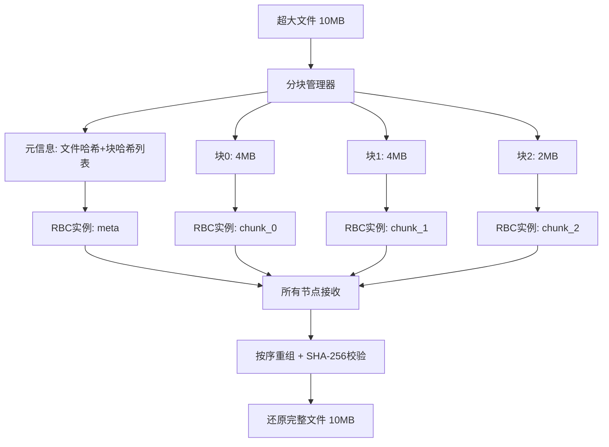

# 高容错分布式数据分发系统

基于 **Bracha RBC（可靠广播协议）** 和 **Reed-Solomon 纠删码** 的拜占庭容错分布式数据分发系统。

## 系统架构

```
┌─────────────────────────────────────────────────┐
│                   应用层 (main.rs)               │
│         程序入口、环境变量配置、RBC输出监控        │
├─────────────────────────────────────────────────┤
│              RBC协议层 (src/rbc/)                │
│  protocol.rs  - Bracha RBC协议核心实现           │
│  chunked.rs   - 超大文件分块广播管理器          │
│  types.rs     - 消息类型、配置、状态定义          │
│  test_rbc.rs  - 单元测试（含拜占庭容错测试）      │
├─────────────────────────────────────────────────┤
│            纠删码层 (src/erasure/)               │
│  codec.rs     - Reed-Solomon编解码器             │
│  shard.rs     - 分片数据结构与哈希校验            │
│  test_erasure.rs - 纠删码单元测试                │
├─────────────────────────────────────────────────┤
│             网络层 (src/network/)                │
│  node.rs       - P2P节点核心逻辑                 │
│  connection.rs - TCP连接管理                     │
│  discovery.rs  - 节点发现机制                    │
│  peer.rs       - 对等节点管理                    │
│  message.rs    - 网络消息序列化/反序列化          │
│  config.rs     - 节点配置                        │
└─────────────────────────────────────────────────┘
```

## 环境要求

### 本地单元测试

- **Rust** >= 1.85（推荐使用 `rustup` 安装）
- **Cargo**（随 Rust 一起安装）

### Docker 集成测试

- **Docker** >= 20.10
- **Docker Compose** >= 2.0
- **Bash**（Linux/macOS 自带，Windows 可使用 Git Bash 或 WSL）

## 快速开始

### 1. 克隆项目

```bash
git clone <仓库地址>
cd bishe
```

### 2. 编译项目

```bash
cargo build --release
```

---

## 测试指南

本系统提供 **三个层次** 的测试：

| 层次 | 测试内容 | 运行方式 | 耗时 |
|------|---------|---------|------|
| **单元测试** | 纠删码编解码 + RBC协议逻辑 + 拜占庭容错 + 分块广播 | `cargo test` | ~5秒 |
| **P2P网络集成测试** | Docker多节点组网、握手、心跳、容错 | `bash test_p2p.sh [-n N]` | ~3分钟 |
| **RBC端到端测试** | Docker多节点文件广播分发与数据完整性验证 | `bash test_rbc_docker.sh [-n N]` | ~20分钟 |

---

### 一、单元测试（本地运行，无需Docker）

#### 运行全部单元测试

```bash
cargo test --lib -- --nocapture
```

#### 按模块运行测试

```bash
# 纠删码模块测试（15个用例）
cargo test --lib erasure::test_erasure -- --nocapture

# RBC协议模块测试（14个用例）
cargo test --lib rbc::test_rbc -- --nocapture
```

#### 按类别运行测试

```bash
# 仅运行RBC基础功能测试
cargo test --lib rbc::test_rbc::test_rbc -- --nocapture

# 仅运行拜占庭恶意节点测试（6个用例）
cargo test --lib rbc::test_rbc::test_byzantine -- --nocapture

# 仅运行分块广播测试（6个用例）
cargo test --lib rbc::chunked -- --nocapture
```

#### 运行单个测试

```bash
# 示例：运行7节点基础测试
cargo test --lib rbc::test_rbc::test_rbc_7_nodes -- --nocapture

# 示例：运行混合攻击测试
cargo test --lib rbc::test_rbc::test_byzantine_mixed_attack_7_nodes -- --nocapture
```

#### 单元测试用例清单

**纠删码模块** (`src/erasure/test_erasure.rs`)：

| 测试名 | 说明 |
|--------|------|
| `test_basic_encode_decode` | 基本编解码正确性 |
| `test_recover_with_lost_data_shards` | 丢失数据分片后恢复 |
| `test_recover_with_lost_parity_shards` | 丢失校验分片后恢复 |
| `test_recover_with_mixed_loss` | 混合丢失分片恢复 |
| `test_too_many_lost_shards` | 超过容错上限的错误处理 |
| `test_small_data` | 小数据编解码 |
| `test_large_data` | 大数据编解码 |
| `test_shard_integrity_verification` | 分片完整性校验（SHA-256） |
| `test_verify_roundtrip` | 编解码往返一致性 |
| `test_storage_overhead` | 存储开销计算 |
| `test_fault_tolerance_info` | 容错信息输出 |
| `test_shard_serialization` | 分片序列化/反序列化 |
| `test_empty_data_error` | 空数据错误处理 |
| `test_invalid_codec_params` | 无效参数错误处理 |
| `test_different_codec_configurations` | 不同编码配置测试 |

**RBC协议模块** (`src/rbc/test_rbc.rs`)：

| 测试名 | 说明 |
|--------|------|
| `test_rbc_config` | RBC配置参数验证 |
| `test_rbc_basic_4_nodes` | 4节点基础广播 |
| `test_rbc_7_nodes` | 7节点广播（n=7, t=2） |
| `test_rbc_with_node_failure` | 节点掉线容错测试 |
| `test_rbc_large_data` | 大数据广播测试 |
| `test_rbc_concurrent_broadcasts` | 并发多实例广播 |
| `test_rbc_10_nodes` | 10节点广播（n=10, t=3） |
| `test_rbc_data_integrity` | 数据完整性校验 |
| `test_byzantine_tampered_shard_data` | 🔴 恶意场景：篡改分片数据 |
| `test_byzantine_fake_hash` | 🔴 恶意场景：伪造数据哈希 |
| `test_byzantine_selective_silence` | 🔴 恶意场景：选择性沉默 |
| `test_byzantine_contradictory_echo` | 🔴 恶意场景：矛盾ECHO攻击 |
| `test_byzantine_mixed_attack_7_nodes` | 🔴 恶意场景：混合攻击 |
| `test_byzantine_max_tolerance_10_nodes` | 🔴 恶意场景：10节点极限容错 |

**分块广播模块** (`src/rbc/chunked.rs`)：

| 测试名 | 说明 |
|--------|------|
| `test_chunked_broadcast_small_file` | 小文件分块广播（100字节） |
| `test_chunked_broadcast_multi_chunk` | 多分块文件广播（5KB→ 5块） |
| `test_chunked_broadcast_large_data` | 大数据分块广播（50KB，7节点） |
| `test_chunked_broadcast_with_node_failure` | 分块广播节点故障容错 |
| `test_chunked_broadcast_non_aligned_size` | 非对齐文件大小分块 |
| `test_chunked_broadcast_exact_one_byte` | 极小文件（1字节）分块广播 |

---

### 二、P2P网络集成测试（需要Docker）

测试 P2P 网络层的组网、握手、心跳和节点容错能力。支持通过 `-n` 参数指定节点总数。

```bash
# 默认7节点测试 (n=7, t=2)
bash test_p2p.sh

# 自定义节点数量
bash test_p2p.sh -n 4    # 4节点测试 (t=1)
bash test_p2p.sh -n 10   # 10节点测试 (t=3)
bash test_p2p.sh -n 13   # 13节点测试 (t=4)

# 查看帮助
bash test_p2p.sh -h
```

脚本会根据 `n` 自动计算容错数 `t = ⌊(n-1)/3⌋`，并动态生成 `docker-compose.dynamic.yml` 配置文件。

**测试内容：**

| 步骤 | 说明 |
|------|------|
| 测试1 | 构建Docker镜像 |
| 测试2 | 启动种子节点 |
| 测试3 | 启动所有普通节点（共n个） |
| 测试4 | 验证节点间握手连接 |
| 测试5 | 验证心跳机制 |
| 测试6 | 容错测试 - 单节点宕机 |
| 测试7 | 容错测试 - t个节点宕机（极限测试） |
| 测试8 | 容错测试 - 故障节点恢复重连 |
| 测试9 | 节点发现机制验证 |

---

### 三、RBC端到端测试（需要Docker）

测试完整的 RBC 协议流程：文件分片 → 纠删码编码 → 网络广播 → 各节点接收 → 纠删码解码恢复 → 数据完整性验证。支持通过 `-n` 参数指定节点总数。

```bash
# 默认7节点测试 (n=7, t=2)
bash test_rbc_docker.sh

# 自定义节点数量
bash test_rbc_docker.sh -n 4    # 4节点测试 (t=1)
bash test_rbc_docker.sh -n 10   # 10节点测试 (t=3)
bash test_rbc_docker.sh -n 13   # 13节点测试 (t=4)

# 查看帮助
bash test_rbc_docker.sh -h
```

脚本会根据 `n` 自动计算容错数 `t = ⌊(n-1)/3⌋`，动态生成 Docker 配置，并自动选择最后 t 个节点作为容错测试的故障节点。

**测试内容：**

| 步骤 | 说明 |
|------|------|
| 测试1 | 小文件广播（1KB） |
| 测试2 | 中等文件广播（100KB） |
| 测试3 | 大文件广播（1MB） |
| 测试4 | 文本文件广播 |
| 测试5 | 单节点故障容错广播（1MB） |
| 测试6 | t个节点故障容错广播（100KB，极限测试） |
| 测试7 | 🆕 超大文件分块广播（20MB，超过16MB限制，自动分块） |
| 测试8 | 🆕 超大文件分块广播（50MB，自动分块） |

每个测试会自动验证所有存活节点接收到的数据的 **SHA-256 哈希** 是否与原始文件一致。

---

## Docker 部署说明

### 网络拓扑

测试脚本会根据 `-n` 参数动态生成 `docker-compose.dynamic.yml`，自动分配节点 IP 和端口：

| 节点 | 容器名 | IP地址 | 宿主机端口 | 角色 |
|------|--------|--------|-----------|------|
| seed | p2p-seed | 172.28.0.10 | 8000 | 种子节点（广播发起者） |
| node1 | p2p-node1 | 172.28.1.1 | 8001 | 普通节点 |
| node2 | p2p-node2 | 172.28.1.2 | 8002 | 普通节点 |
| ... | ... | ... | ... | ... |
| nodeN | p2p-nodeN | 172.28.1.N | 800N | 普通节点 |

> 默认的 `docker-compose.yml` 仍保留7节点静态配置，可直接用 `docker compose up -d` 手动启动。

### 手动启动集群

```bash
# 方式1: 使用默认7节点静态配置
docker compose build
docker compose up -d

# 方式2: 使用测试脚本动态生成的配置
bash test_p2p.sh -n 10  # 会自动生成 docker-compose.dynamic.yml

# 查看节点状态
docker compose ps

# 查看某个节点日志
docker compose logs -f seed

# 停止并清理
docker compose down -v --remove-orphans
```

### 环境变量

| 变量名 | 说明 | 默认值 |
|--------|------|--------|
| `NODE_ID` | 节点唯一标识 | - |
| `LISTEN_PORT` | 监听端口 | 8000 |
| `SEED_ADDR` | 种子节点地址 | - |
| `IS_SEED` | 是否为种子节点 | false |
| `RUST_LOG` | 日志级别 | info |
| `RBC_TEST_FILE` | RBC测试文件路径 | - |
| `RBC_BROADCAST_DELAY` | 广播前等待时间（秒） | 35 |
| `RBC_OUTPUT_DIR` | RBC输出目录 | /app/rbc_output |

---

## 核心参数说明

对于 n 个节点的系统，最大容错数 `t = ⌊(n-1)/3⌋`：

| 总节点数 n | 最大容错 t | 数据分片数 | 校验分片数 | ECHO阈值 | READY阈值 |
|-----------|-----------|-----------|-----------|----------|----------|
| 4 | 1 | 2 | 2 | 3 | 2 |
| 7 | 2 | 3 | 4 | 5 | 3 |
| 10 | 3 | 4 | 6 | 7 | 4 |

- **数据分片数** = t + 1
- **校验分片数** = n - (t + 1)
- **ECHO阈值** = 2t + 1（需要收到这么多一致的ECHO才进入READY阶段）
- **READY阈值** = t + 1（需要收到这么多一致的READY才输出数据）

---

## 项目结构

```
bishe/
├── Cargo.toml                  # Rust项目配置和依赖
├── Cargo.lock                  # 依赖锁定文件
├── Dockerfile                  # Docker镜像构建文件
├── docker-compose.yml          # 默认7节点集群编排配置（向后兼容）
├── docker-compose.dynamic.yml  # 测试脚本动态生成的配置（自动创建）
├── test_p2p.sh                 # P2P网络集成测试脚本（支持 -n 参数）
├── test_rbc_docker.sh          # RBC端到端测试脚本（支持 -n 参数）
├── README.md                   # 本文件
└── src/
    ├── main.rs                 # 程序入口
    ├── lib.rs                  # 库模块声明
    ├── erasure/                # 纠删码模块
    │   ├── mod.rs
    │   ├── codec.rs            # Reed-Solomon编解码器
    │   ├── shard.rs            # 分片数据结构
    │   └── test_erasure.rs     # 纠删码单元测试（15个用例）
    ├── rbc/                    # RBC协议模块
    │   ├── mod.rs
    │   ├── protocol.rs         # Bracha RBC协议实现
    │   ├── chunked.rs          # 超大文件分块广播管理器（6个单元测试）
    │   ├── types.rs            # 类型定义
    │   └── test_rbc.rs         # RBC单元测试（14个用例，含6个拜占庭测试）
    └── network/                # P2P网络模块
        ├── mod.rs
        ├── node.rs             # P2P节点核心
        ├── connection.rs       # TCP连接管理
        ├── discovery.rs        # 节点发现
        ├── peer.rs             # 对等节点管理
        ├── message.rs          # 消息序列化
        └── config.rs           # 节点配置
```

---

## 超大文件分块广播

### 设计原理

系统支持**不限大小**的文件传输。当文件大小超过 4MB 时，自动启用分块广播模式：

```
超大文件 → 分块(4MB/块) → 每块独立RBC广播 → 接收端按序重组 → 还原完整文件
```



### 工作流程

1. **广播者**将文件按 4MB 分块，计算每块和整个文件的 SHA-256 哈希
2. 先通过 RBC 广播**元信息**（包含文件大小、分块数、各块哈希）
3. 再逐块通过独立的 RBC 实例广播每个数据块
4. **接收端**收到元信息后，自动收集各块数据
5. 所有块到齐后按序重组，验证每块哈希和整体文件哈希
6. 哈希全部匹配后输出完整文件

### 关键特性

| 特性 | 说明 |
|------|------|
| **自动分块** | 文件 ≤ 4MB 直接 RBC 广播，> 4MB 自动分块 |
| **不限大小** | 理论上支持任意大小的文件传输 |
| **完整性保证** | 每块 SHA-256 校验 + 整体文件 SHA-256 校验 |
| **拜占庭容错** | 每个分块独立走 RBC 协议，继承完整的 BFT 保证 |
| **并发广播** | 多个分块可并发进行 RBC 广播 |
| **透明切换** | 调用者无需关心文件大小，系统自动选择广播模式 |
