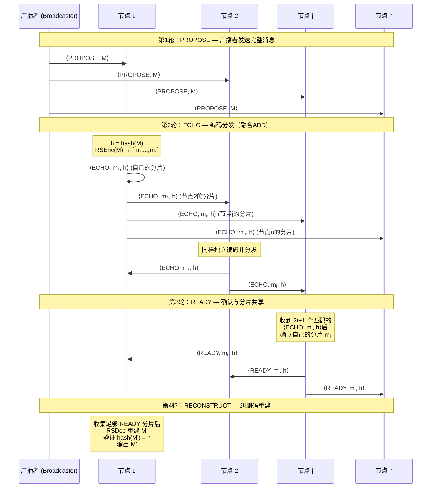
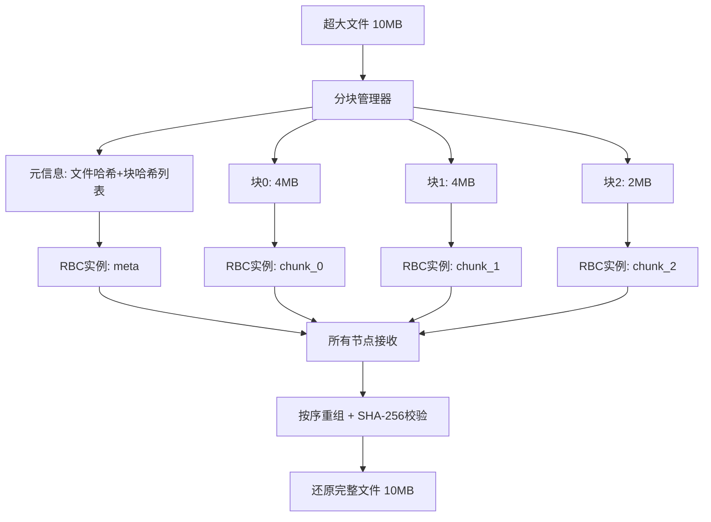

# 高容错分布式数据分发系统

基于 **Bracha RBC（可靠广播协议）** 和 **Reed-Solomon 纠删码** 的拜占庭容错分布式数据分发系统。

## 系统架构

```
┌─────────────────────────────────────────────────┐
│                   应用层 (main.rs)               │
│         程序入口、环境变量配置、RBC输出监控        │
├─────────────────────────────────────────────────┤
│              RBC协议层 (src/rbc/)                │
│  protocol.rs  - Bracha RBC协议核心状态机（含计时日志）│
│  manager.rs   - 多实例并发管理器                 │
│  chunked.rs   - 超大文件分块广播管理器          │
│  types.rs     - 消息类型、配置、状态定义          │
│  test_rbc.rs  - 单元测试（含拜占庭容错+切片策略对比）│
├─────────────────────────────────────────────────┤
│            纠删码层 (src/erasure/)               │
│  codec.rs     - Reed-Solomon编解码器             │
│  shard.rs     - 分片数据结构与序列化              │
│  test_erasure.rs - 纠删码单元测试                │
├─────────────────────────────────────────────────┤
│             网络层 (src/network/)                │
│  node.rs       - P2P节点核心逻辑                 │
│  connection.rs - TCP连接管理                     │
│  discovery.rs  - 节点发现机制                    │
│  peer.rs       - 对等节点管理                    │
│  message.rs    - 网络消息序列化/反序列化          │
│  config.rs     - 节点配置                        │
└─────────────────────────────────────────────────┘
```

## 核心算法：基于 ADD 优化的四轮长消息 RBC 协议

### 算法背景

本系统的核心是一个**融合了 ADD（Avid Data Dissemination）编码分发思想的 Bracha RBC 协议**。

经典的 Bracha RBC 协议在广播长消息时存在 **O(n²|M|)** 的通信复杂度问题——每个节点都需要转发完整消息，导致网络开销随节点数平方增长。ADD 协议通过纠删码将消息编码为 n 个分片，每个节点只需转发自己的分片，将通信复杂度降低到 **O(n|M|)**。

本系统将两者融合：**将 ADD 的"编码与分发"过程嵌入到 Bracha RBC 的 ECHO 和 READY 投票消息中**，在保持拜占庭容错能力的同时，大幅降低通信开销。

### 协议参数

对于 n 个节点的网络，最大容错拜占庭节点数 `t = ⌊(n-1)/3⌋`（满足 `n ≥ 3t + 1`）：

| 参数 | 计算公式 | 含义 |
|------|---------|------|
| **数据分片数 k** | k = t + 1 | RS 编码的信息符号数 |
| **总分片数 n** | 等于节点数 | 每个节点对应一个分片 |
| **校验分片数** | n - k | RS 编码的冗余符号数 |
| **ECHO 阈值** | 2t + 1 | 确认分片所需的一致 ECHO 数 |
| **READY 放大阈值** | t + 1 | 触发 READY 放大所需的 READY 数 |
| **重建阈值** | 2t + r + 1 (r=0..t) | 纠错重建所需的最小分片数 |

### 四轮协议流程



### 算法伪代码

```
算法：四轮长消息 RBC 协议（融合 ADD 优化）
输入：广播者持有消息 M，网络共 n 个节点，容错上限 t = ⌊(n-1)/3⌋

═══════════════════════════════════════════════════════════════
第1轮 PROPOSE（广播者执行）:
═══════════════════════════════════════════════════════════════
  1: 广播者向所有节点发送 ⟨PROPOSE, M⟩

═══════════════════════════════════════════════════════════════
第2轮 ECHO（所有节点执行）:
═══════════════════════════════════════════════════════════════
  2: upon receiving ⟨PROPOSE, M⟩ from broadcaster:
  3:   if P(M) = true then                    // 验证消息合法性
  4:     h := hash(M)                          // 计算消息哈希
  5:     [m₁, m₂, ..., mₙ] := RSEnc(M, n, t+1)  // RS编码为n个分片
  6:     for j = 1 to n do
  7:       send ⟨ECHO, mⱼ, h⟩ to node j       // 向节点j发送其专属分片

═══════════════════════════════════════════════════════════════
第3轮 READY（所有节点执行）:
═══════════════════════════════════════════════════════════════
  8: upon receiving 2t+1 matching ⟨ECHO, mᵢ, h⟩:
  9:   if not yet sent READY then
 10:     确立自己的分片 mᵢ                     // 2t+1个一致ECHO确认
 11:     send ⟨READY, mᵢ, h⟩ to all           // 向全网广播自己的分片

 12: upon receiving t+1 ⟨READY, *, h⟩ and not yet sent READY:
 13:   wait for t+1 matching ⟨ECHO, mᵢ', h⟩   // READY放大机制
 14:   send ⟨READY, mᵢ', h⟩ to all

═══════════════════════════════════════════════════════════════
第4轮 RECONSTRUCT（所有节点执行）:
═══════════════════════════════════════════════════════════════
 15: 维护分片集合 T_h = {(j, mⱼ*)}            // 从READY消息中收集
 16: for r = 0 to t do                         // 逐步增加纠错容量
 17:   upon |T_h| ≥ 2t + r + 1 do
 18:     M' := RSDec(t+1, r, T_h)              // RS解码（纠r个错）
 19:     if hash(M') = h then                  // 哈希验证
 20:       output M' and return                // 输出并终止
```

### 与经典协议的对比

| 特性 | 经典 Bracha RBC | ADD 协议 | 本系统（融合方案） |
|------|----------------|----------|------------------|
| **通信复杂度** | O(n²\|M\|) | O(n\|M\|) | **O(n\|M\|)** |
| **拜占庭容错** | ✅ t < n/3 | ❌ 仅崩溃容错 | **✅ t < n/3** |
| **消息轮次** | 3轮 | 3轮 | **4轮** |
| **ECHO 内容** | 完整消息 M | 分片 mⱼ | **分片 mⱼ + 哈希 h** |
| **READY 内容** | 哈希 h | 分片 mⱼ | **分片 mⱼ + 哈希 h** |
| **数据重建** | 无需（已有完整消息） | RS 解码 | **RS 解码 + 哈希验证** |
| **纠错能力** | — | 仅纠删 | **逐步纠错 (r=0..t)** |

### 关键设计亮点

#### 1. ECHO 阶段融合编码分发

经典 Bracha RBC 的 ECHO 消息携带完整消息 M，导致每个节点需要发送 n 份完整消息。本方案将 ADD 的编码分发融入 ECHO 阶段：每个节点独立对 M 进行 RS 编码，然后**只向节点 j 发送其专属分片 mⱼ**，而非完整消息。这将 ECHO 阶段的通信量从 O(n²|M|) 降低到 O(n|M|)。

#### 2. READY 阶段携带分片实现 Reconstruction 共享

经典 Bracha RBC 的 READY 消息只携带哈希值。本方案让 READY 消息**同时携带发送者自己的分片**，使得 READY 阶段不仅完成投票确认，还同时完成了分片的全网共享，为后续的纠删码重建提供数据来源。

#### 3. 渐进式纠错重建

在 RECONSTRUCT 阶段，算法不是简单地等待足够分片后一次性解码，而是采用**渐进式纠错策略**：从 r=0（无纠错，需要 2t+1 个分片）开始，逐步增加纠错容量到 r=t（最大纠错，需要 3t+1 个分片）。每次尝试解码后都通过哈希验证结果正确性，确保即使存在拜占庭节点发送错误分片，也能通过增加冗余来纠正。

```
r=0: 需要 2t+1 个分片，纠 0 个错（所有分片都正确时最快完成）
r=1: 需要 2t+2 个分片，纠 1 个错
...
r=t: 需要 3t+1 个分片，纠 t 个错（极限容错）
```

#### 4. Berlekamp-Welch 纠错 + 整体哈希验证

本协议**不在分片级别做哈希校验**，而是依赖底层 RS 码的 Berlekamp-Welch 纠错能力自动检测和纠正恶意分片。这是算法4的核心设计：

- **纠错解码**：`RSDec(t+1, r, T_h)` 使用 Berlekamp-Welch 算法，可在不知道哪些分片被篡改的情况下，自动纠正最多 `⌊(|T_h| - k) / 2⌋` 个错误分片
- **整体哈希验证**：解码后通过 `hash(M') = h` 验证最终结果的正确性，确保输出与广播者原始消息一致
- **无分片级校验**：ECHO 和 READY 消息中不携带分片哈希（`shard_hash`），恶意分片直接进入 T_h 集合，由纠错解码统一处理

### 安全性保证

在 n ≥ 3t + 1 的前提下，本协议满足 RBC 的三个核心安全属性：

| 属性 | 说明 | 保证机制 |
|------|------|---------|
| **一致性 (Agreement)** | 如果两个诚实节点分别输出 M 和 M'，则 M = M' | ECHO 阈值 2t+1 确保至少 t+1 个诚实节点确认同一哈希 |
| **完整性 (Validity)** | 如果广播者是诚实的且广播 M，则所有诚实节点最终输出 M | 诚实广播者的 PROPOSE 保证所有诚实节点收到正确消息 |
| **终止性 (Totality)** | 如果某个诚实节点输出了消息，则所有诚实节点最终都会输出 | READY 放大机制确保：一旦 t+1 个节点发送 READY，所有诚实节点都会跟进 |

---

## 环境要求

### 本地单元测试

- **Rust** >= 1.85（推荐使用 `rustup` 安装）
- **Cargo**（随 Rust 一起安装）

### Docker 集成测试

- **Docker** >= 20.10
- **Docker Compose** >= 2.0
- **Bash**（Linux/macOS 自带，Windows 可使用 Git Bash 或 WSL）

## 快速开始

### 1. 克隆项目

```bash
git clone https://github.com/sway-wzc/bishe.git
cd bishe
```

### 2. 编译项目

```bash
cargo build --release
```

---

## 测试指南

本系统提供 **三个层次** 的测试：

| 层次 | 测试内容 | 运行方式 | 耗时 |
|------|---------|---------|------|
| **单元测试** | 纠删码编解码 + RBC协议逻辑 + 拜占庭容错 + 分块广播 + 切片策略对比实验（50个用例） | `cargo test` | ~5秒 |
| **P2P网络集成测试** | Docker多节点组网、握手、心跳、容错 | `bash test_p2p.sh [-n N]` | ~3分钟 |
| **RBC端到端测试** | Docker多节点文件广播分发与数据完整性验证 | `bash test_rbc_docker.sh [-n N]` | ~20分钟 |

---

### 一、单元测试（本地运行，无需Docker）

#### 运行全部单元测试

```bash
cargo test --lib -- --nocapture
```

#### 按模块运行测试

```bash
# 纠删码模块测试（22个用例）
cargo test --lib erasure::test_erasure -- --nocapture

# RBC协议模块测试（22个用例，含6个切片策略对比实验）
cargo test --lib rbc::test_rbc -- --nocapture
```

#### 按类别运行测试

```bash
# 仅运行RBC基础功能测试
cargo test --lib rbc::test_rbc::test_rbc -- --nocapture

# 仅运行拜占庭恶意节点测试（8个用例）
cargo test --lib rbc::test_rbc::test_byzantine -- --nocapture

# 仅运行切片策略对比实验（6个用例）
cargo test --lib rbc::test_rbc::test_strategy -- --nocapture

# 仅运行分块广播测试（6个用例）
cargo test --lib rbc::chunked -- --nocapture
```

#### 运行单个测试

```bash
# 示例：运行7节点基础测试
cargo test --lib rbc::test_rbc::test_rbc_7_nodes -- --nocapture

# 示例：运行混合攻击测试
cargo test --lib rbc::test_rbc::test_byzantine_mixed_attack_7_nodes -- --nocapture
```

#### 单元测试用例清单

**纠删码模块** (`src/erasure/test_erasure.rs`)：

| 测试名 | 说明 |
|--------|------|
| `test_basic_encode_decode` | 基本编解码正确性 |
| `test_recover_with_lost_data_shards` | 丢失数据分片后恢复 |
| `test_recover_with_lost_parity_shards` | 丢失校验分片后恢复 |
| `test_recover_with_mixed_loss` | 混合丢失分片恢复 |
| `test_too_many_lost_shards` | 超过容错上限的错误处理 |
| `test_small_data` | 小数据编解码 |
| `test_large_data` | 大数据编解码 |
| `test_shard_integrity_verification` | 分片完整性校验（SHA-256） |
| `test_verify_roundtrip` | 编解码往返一致性 |
| `test_storage_overhead` | 存储开销计算 |
| `test_fault_tolerance_info` | 容错信息输出 |
| `test_shard_serialization` | 分片序列化/反序列化 |
| `test_empty_data_error` | 空数据错误处理 |
| `test_invalid_codec_params` | 无效参数错误处理 |
| `test_different_codec_configurations` | 不同编码配置测试 |
| `test_error_correction_single_corruption` | 🔧 Berlekamp-Welch 单分片纠错 |
| `test_error_correction_two_corruptions` | 🔧 Berlekamp-Welch 双分片纠错 |
| `test_error_correction_mixed_loss_and_corruption` | 🔧 丢失+篡改混合纠错 |
| `test_error_correction_with_larger_parity` | 🔧 高冗余配置纠错 |
| `test_error_correction_exceeds_capacity` | 🔧 超过纠错能力的损坏测试 |
| `test_error_correction_capacity_values` | 🔧 纠错容量边界值测试 |
| `test_error_correction_large_data` | 🔧 大数据纠错测试 |

**RBC协议模块** (`src/rbc/test_rbc.rs`)：

| 测试名 | 说明 |
|--------|------|
| `test_rbc_config` | RBC配置参数验证 |
| `test_rbc_basic_4_nodes` | 4节点基础广播 |
| `test_rbc_7_nodes` | 7节点广播（n=7, t=2） |
| `test_rbc_with_node_failure` | 节点掉线容错测试 |
| `test_rbc_large_data` | 大数据广播测试 |
| `test_rbc_concurrent_broadcasts` | 并发多实例广播 |
| `test_rbc_10_nodes` | 10节点广播（n=10, t=3） |
| `test_rbc_data_integrity` | 数据完整性校验 |
| `test_byzantine_tampered_shard_data` | 🔴 恶意场景：篡改分片数据 |
| `test_byzantine_fake_hash` | 🔴 恶意场景：伪造数据哈希 |
| `test_byzantine_selective_silence` | 🔴 恶意场景：选择性沉默 |
| `test_byzantine_contradictory_echo` | 🔴 恶意场景：矛盾ECHO攻击 |
| `test_byzantine_mixed_attack_7_nodes` | 🔴 恶意场景：混合攻击 |
| `test_byzantine_max_tolerance_10_nodes` | 🔴 恶意场景：10节点极限容错 |
| `test_byzantine_forged_shard_index` | 🔴 恶意场景：伪造分片索引（7节点） |
| `test_byzantine_forged_shard_index_10_nodes` | 🔴 恶意场景：10节点极限伪造索引攻击 |
| `test_strategy_compare_k_values_7_nodes` | 📊 实验1：RS编码参数对比（n=7, 不同k值对传输/计算开销的影响） |
| `test_strategy_compare_k_values_10_nodes` | 📊 实验1b：RS编码参数对比（n=10, 不同k值） |
| `test_strategy_compare_file_sizes` | 📊 实验2：文件大小扩展性（不同文件大小对开销的影响） |
| `test_strategy_compare_chunk_sizes` | 📊 实验3：分块大小对比（不同分块大小对大文件传输开销的影响） |
| `test_strategy_compare_node_scales` | 📊 实验4：节点规模扩展性（不同节点数对开销的影响） |
| `test_strategy_no_coding_baseline` | 📊 实验5：无编码基线对比（证明纠删码的传输优化价值） |

**分块广播模块** (`src/rbc/chunked.rs`)：

| 测试名 | 说明 |
|--------|------|
| `test_chunked_broadcast_small_file` | 小文件分块广播（100字节） |
| `test_chunked_broadcast_multi_chunk` | 多分块文件广播（5KB→ 5块） |
| `test_chunked_broadcast_large_data` | 大数据分块广播（50KB，7节点） |
| `test_chunked_broadcast_with_node_failure` | 分块广播节点故障容错 |
| `test_chunked_broadcast_non_aligned_size` | 非对齐文件大小分块 |
| `test_chunked_broadcast_exact_one_byte` | 极小文件（1字节）分块广播 |

---

### 二、P2P网络集成测试（需要Docker）

测试 P2P 网络层的组网、握手、心跳和节点容错能力。支持通过 `-n` 参数指定节点总数。

```bash
# 默认7节点测试 (n=7, t=2)
bash test_p2p.sh

# 自定义节点数量
bash test_p2p.sh -n 4    # 4节点测试 (t=1)
bash test_p2p.sh -n 10   # 10节点测试 (t=3)
bash test_p2p.sh -n 13   # 13节点测试 (t=4)

# 查看帮助
bash test_p2p.sh -h
```

脚本会根据 `n` 自动计算容错数 `t = ⌊(n-1)/3⌋`，并动态生成 `docker-compose.dynamic.yml` 配置文件。

**测试内容：**

| 步骤 | 说明 |
|------|------|
| 测试1 | 构建Docker镜像 |
| 测试2 | 启动种子节点 |
| 测试3 | 启动所有普通节点（共n个） |
| 测试4 | 验证节点间握手连接 |
| 测试5 | 验证心跳机制 |
| 测试6 | 容错测试 - 单节点宕机 |
| 测试7 | 容错测试 - t个节点宕机（极限测试） |
| 测试8 | 容错测试 - 故障节点恢复重连 |
| 测试9 | 节点发现机制验证 |

---

### 三、RBC端到端测试（需要Docker）

测试完整的 RBC 协议流程：文件分片 → 纠删码编码 → 网络广播 → 各节点接收 → 纠删码解码恢复 → 数据完整性验证。支持通过 `-n` 参数指定节点总数。

```bash
# 默认7节点测试 (n=7, t=2)
bash test_rbc_docker.sh

# 自定义节点数量
bash test_rbc_docker.sh -n 4    # 4节点测试 (t=1)
bash test_rbc_docker.sh -n 10   # 10节点测试 (t=3)
bash test_rbc_docker.sh -n 13   # 13节点测试 (t=4)

# 查看帮助
bash test_rbc_docker.sh -h
```

脚本会根据 `n` 自动计算容错数 `t = ⌊(n-1)/3⌋`，动态生成 Docker 配置，并自动选择最后 t 个节点作为容错测试的故障节点。

**测试内容：**

| 步骤 | 说明 |
|------|------|
| 测试1 | 小文件广播（1KB） |
| 测试2 | 中等文件广播（100KB） |
| 测试3 | 大文件广播（1MB） |
| 测试4 | 文本文件广播 |
| 测试5 | 单节点故障容错广播（1MB） |
| 测试6 | t个节点故障容错广播（100KB，极限测试） |
| 测试7 | 超大文件分块广播（20MB，超过16MB限制，自动分块） |
| 测试8 | 超大文件分块广播（50MB，自动分块） |
| 测试9 | 🔴 恶意节点-篡改分片数据（100KB，1个节点发送被篡改的分片） |
| 测试10 | 🔴 恶意节点-伪造哈希（100KB，1个节点发送伪造的数据哈希） |
| 测试11 | 🔴 恶意节点-选择性沉默（100KB，1个节点拒绝发送ECHO/READY消息） |
| 测试12 | 🔴 t个混合恶意节点（100KB，BFT极限测试，t个节点同时以不同方式作恶） |

- 测试1-8 验证所有存活节点接收到的数据的 **SHA-256 哈希** 是否与原始文件一致
- 测试9-12 为**拜占庭容错测试**，验证在恶意节点存在的情况下，所有诚实节点仍能正确完成 RBC 协议并输出正确数据，同时通过日志确认恶意行为已实际执行
- 每个测试用例自动采集**传输开销**（各节点网络收发字节数、传输放大比）和**计算开销**（RS编码/解码耗时、SHA-256哈希耗时），统计数据保存至 `rbc_stats_tmp/overhead_summary.csv`

---

## Docker 部署说明

### 网络拓扑

测试脚本会根据 `-n` 参数动态生成 `docker-compose.dynamic.yml`，自动分配节点 IP 和端口：

| 节点 | 容器名 | IP地址 | 宿主机端口 | 角色 |
|------|--------|--------|-----------|------|
| seed | p2p-seed | 172.28.0.10 | 8000 | 种子节点（广播发起者） |
| node1 | p2p-node1 | 172.28.1.1 | 8001 | 普通节点 |
| node2 | p2p-node2 | 172.28.1.2 | 8002 | 普通节点 |
| ... | ... | ... | ... | ... |
| nodeN | p2p-nodeN | 172.28.1.N | 800N | 普通节点 |

> 默认的 `docker-compose.yml` 仍保留7节点静态配置，可直接用 `docker compose up -d` 手动启动。

### 手动启动集群

```bash
# 方式1: 使用默认7节点静态配置
docker compose build
docker compose up -d

# 方式2: 使用测试脚本动态生成的配置
bash test_p2p.sh -n 10  # 会自动生成 docker-compose.dynamic.yml

# 查看节点状态
docker compose ps

# 查看某个节点日志
docker compose logs -f seed

# 停止并清理
docker compose down -v --remove-orphans
```

### 环境变量

| 变量名 | 说明 | 默认值 |
|--------|------|--------|
| `NODE_ID` | 节点唯一标识 | - |
| `LISTEN_PORT` | 监听端口 | 8000 |
| `SEED_ADDR` | 种子节点地址 | - |
| `IS_SEED` | 是否为种子节点 | false |
| `RUST_LOG` | 日志级别 | info |
| `RBC_TEST_FILE` | RBC测试文件路径 | - |
| `RBC_BROADCAST_DELAY` | 广播前等待时间（秒） | 35 |
| `RBC_OUTPUT_DIR` | RBC输出目录 | /app/rbc_output |
| `BYZANTINE_MODE` | 拜占庭模式（测试用：corrupt_shard/wrong_hash/silent） | - |
| `EXPECTED_NODES` | 期望的节点总数 | - |

---

## 核心参数说明

对于 n 个节点的系统，最大容错数 `t = ⌊(n-1)/3⌋`：

| 总节点数 n | 最大容错 t | 数据分片数 | 校验分片数 | ECHO阈值 | READY阈值 |
|-----------|-----------|-----------|-----------|----------|----------|
| 4 | 1 | 2 | 2 | 3 | 2 |
| 7 | 2 | 3 | 4 | 5 | 3 |
| 10 | 3 | 4 | 6 | 7 | 4 |

- **数据分片数** = t + 1
- **校验分片数** = n - (t + 1)
- **ECHO阈值** = 2t + 1（需要收到这么多一致的ECHO才进入READY阶段）
- **READY阈值** = t + 1（需要收到这么多一致的READY才输出数据）

---

## 项目结构

```
bishe/
├── Cargo.toml                  # Rust项目配置和依赖
├── Cargo.lock                  # 依赖锁定文件
├── Dockerfile                  # Docker镜像构建文件
├── docker-compose.yml          # 默认7节点集群编排配置（向后兼容）
├── docker-compose.dynamic.yml  # 测试脚本动态生成的配置（自动创建）
├── test_p2p.sh                 # P2P网络集成测试脚本（支持 -n 参数）
├── test_rbc_docker.sh          # RBC端到端测试脚本（支持 -n 参数）
├── README.md                   # 本文件
└── src/
    ├── main.rs                 # 程序入口
    ├── lib.rs                  # 库模块声明
    ├── erasure/                # 纠删码模块
    │   ├── mod.rs
    │   ├── codec.rs            # Reed-Solomon编解码器
    │   ├── shard.rs            # 分片数据结构
    │   └── test_erasure.rs     # 纠删码单元测试（22个用例，含7个Berlekamp-Welch纠错测试）
    ├── rbc/                    # RBC协议模块
    │   ├── mod.rs
    │   ├── protocol.rs         # Bracha RBC协议核心状态机（含RS编解码/哈希计时日志）
    │   ├── manager.rs          # 多实例并发管理器（RbcManager）
    │   ├── chunked.rs          # 超大文件分块广播管理器（6个单元测试）
    │   ├── types.rs            # 类型定义（含自定义分片参数 with_custom_shards）
    │   └── test_rbc.rs         # RBC单元测试（22个用例，含8个拜占庭+6个切片策略对比实验）
    └── network/                # P2P网络模块
        ├── mod.rs
        ├── node.rs             # P2P节点核心
        ├── connection.rs       # TCP连接管理
        ├── discovery.rs        # 节点发现
        ├── peer.rs             # 对等节点管理
        ├── message.rs          # 消息序列化
        └── config.rs           # 节点配置
```

---

## 超大文件分块广播

### 设计原理

系统支持**不限大小**的文件传输。当文件大小超过 4MB 时，自动启用分块广播模式：

```
超大文件 → 分块(4MB/块) → 每块独立RBC广播 → 接收端按序重组 → 还原完整文件
```



### 工作流程

1. **广播者**将文件按 4MB 分块，计算每块和整个文件的 SHA-256 哈希
2. 先通过 RBC 广播**元信息**（包含文件大小、分块数、各块哈希）
3. 再逐块通过独立的 RBC 实例广播每个数据块
4. **接收端**收到元信息后，自动收集各块数据
5. 所有块到齐后按序重组，验证每块哈希和整体文件哈希
6. 哈希全部匹配后输出完整文件

### 关键特性

| 特性 | 说明 |
|------|------|
| **自动分块** | 文件 ≤ 4MB 直接 RBC 广播，> 4MB 自动分块 |
| **不限大小** | 理论上支持任意大小的文件传输 |
| **完整性保证** | 每块 SHA-256 校验 + 整体文件 SHA-256 校验 |
| **拜占庭容错** | 每个分块独立走 RBC 协议，继承完整的 BFT 保证 |
| **并发广播** | 多个分块可并发进行 RBC 广播 |
| **透明切换** | 调用者无需关心文件大小，系统自动选择广播模式 |

---

## 切片策略对比实验

系统内置了 **6 组切片策略对比实验**，用于量化分析不同 RS 编码参数对传输开销与计算开销的影响。

### 运行实验

```bash
# 运行全部6个切片策略对比实验
cargo test --lib rbc::test_rbc::test_strategy -- --nocapture

# 运行单个实验
cargo test --lib rbc::test_rbc::test_strategy_compare_k_values_7_nodes -- --nocapture
cargo test --lib rbc::test_rbc::test_strategy_no_coding_baseline -- --nocapture
```

### 实验设计

| 实验 | 变量 | 固定参数 | 目的 |
|------|------|---------|------|
| **实验1** | k=2,3,4,5,6 | n=7, 100KB | 不同 k 值对传输放大比和编解码耗时的影响 |
| **实验1b** | k=2,4,5,7,9 | n=10, 100KB | 10 节点场景下的 k 值对比 |
| **实验2** | 1KB~1MB | n=7, k=3 | 文件大小对传输放大比和编解码耗时的扩展性 |
| **实验3** | 5KB~50KB 分块 | n=7, 50KB | 不同分块大小对大文件传输开销的影响 |
| **实验4** | n=4,7,10,13 | k=t+1, 100KB | 节点规模对传输放大比的扩展性 |
| **实验5** | k=1~6 | n=7, 100KB | 无编码基线 vs 纠删码策略的传输优化价值 |

### 统计指标

每个实验自动统计以下指标：

| 指标 | 说明 |
|------|------|
| **传输消息数** | RBC 协议中 PROPOSE/ECHO/READY 消息的总数 |
| **传输字节数** | 所有消息的总传输量（含分片数据和元信息） |
| **传输放大比** | 总传输字节数 / 原始文件大小 |
| **RS 编码耗时** | Reed-Solomon 编码的计算时间 |
| **RS 解码耗时** | Reed-Solomon 解码的计算时间 |
| **端到端总耗时** | 从广播发起到所有节点完成的总时间 |

### 实验结论示例（n=7, 100KB）

| 策略 | k | p | 传输放大比 | RS编码 | RS解码 |
|------|---|---|-----------|--------|--------|
| 无编码基线 | 1 | 6 | **105.13x** | 14.0ms | 12.6ms |
| 高冗余 | 2 | 5 | 56.13x | 8.7ms | 6.5ms |
| **标准(k=t+1)** | **3** | **4** | **39.80x** | **6.5ms** | **4.1ms** |
| 对称 | 4 | 3 | 31.63x | 5.2ms | 2.7ms |
| 低冗余 | 6 | 1 | 23.46x | 3.4ms | 0.9ms |

> **结论**：k 越大，传输放大比和计算开销均越低，但纠错能力越弱。标准策略 k=t+1 是安全性与效率的最佳平衡点——相比无编码基线节省 **62.1%** 传输量，同时计算开销也更低。

### Docker 端到端开销统计

RBC 端到端测试脚本（`test_rbc_docker.sh`）也内置了开销统计功能：

- **传输开销**：通过 Docker 容器网络接口统计（`/sys/class/net/eth0/statistics/`）采集各节点发送字节数（TX），传输放大比 = 总TX / 原始文件大小
- **计算开销**：从容器日志中提取 RS 编码/解码和 SHA-256 哈希的耗时数据
- **理论分析**：自动计算 PROPOSE/ECHO/READY 各阶段的理论传输量、理论传输放大比，以及修正传输放大比（`理论值 × (n-1)/n`，扣除本地消息不经过网卡的部分）
- **CSV 汇总**：所有测试的开销数据自动写入 `rbc_stats_tmp/overhead_summary.csv`，便于后续分析

#### 实测数据与理论值对比（n=7, t=2）

| 测试场景 | 文件大小 | 实测TX放大比 | 修正理论放大比 | 误差 |
|---|---|---|---|---|
| 大文件广播 | 1MB | 35.03x | 33.99x | +3.1% |
| 超大文件分块广播 | 20MB | 34.10x | 33.99x | +0.3% |
| 超大文件分块广播 | 50MB | 34.07x | 33.99x | +0.2% |
| 中等文件广播 | 100KB | 43.55x | 33.99x | +28%* |
| 小文件广播 | 1KB | 919.28x | 33.99x | 极大* |

> \* 小文件的偏差主要来自控制面流量（心跳、节点发现等固定开销），文件越小占比越大。大文件（≥1MB）的实测值与修正理论值高度吻合（误差 <3%）。
>
> **修正理论放大比** = 理论放大比 × (n-1)/n = 39.66 × 6/7 ≈ 33.99x。因为每个节点发给自己的 ECHO/READY 消息在本地直接处理，不经过网卡，所以实际网卡统计到的 TX 比理论值少 1/n。
